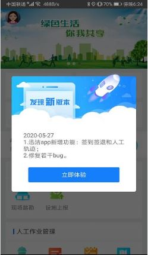
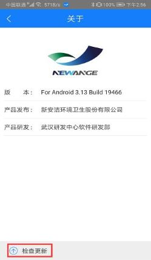

## app升级更新
迅洁app的升级有三种方式：
1. app发布后，重新登录app，系统自动弹出升级更新框，点击立即体验，下载安装即可；
2. 点击头像-【关于】-【检查更新】，系统会弹出升级更新提示框，点击立即体验，下载安装。如果已经更新过会提示：当前已是最新版本！
3. 卸载迅洁app，在pc端登录首页重新扫描二维码下载安装包，安装即可。
（具体方法参考【app下载和安装】的章节）
