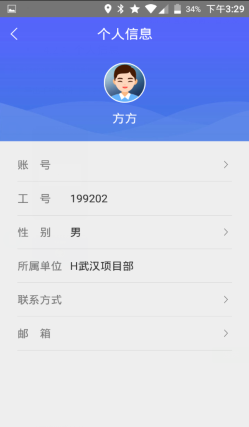
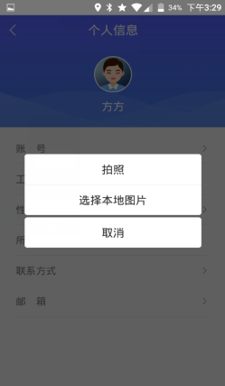
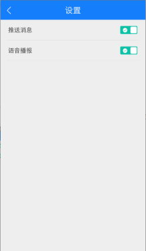

## 个人信息
设置头像、如果首次登录没有设置账号，可以点击账号进行设置；
也可以修改性别、联系方式、邮箱
注意：设置头像可以拍照，也可以选择本地图片；账号只能被设置一次，如果首次登录设置过账号，则个人信息里不能再次设置账号。

* **修改密码**
用户输入正确的当前密码，新密码和确认密码，点击右上角完成，即密码修改成功，下次登录需使用新密码才能登录

 
* **设置**
设置消息推送的开关和语音播报的开关
打开消息推送，如果有推送消息，app就会接收到消息；关闭消息推送则无法接收到消息提醒。打开语音播报，则接收到的消息会有语音提醒，反之，没有语音提醒
