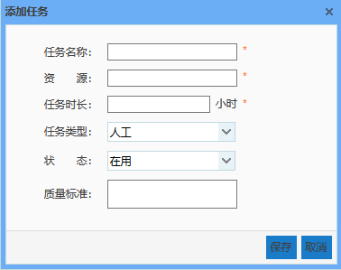
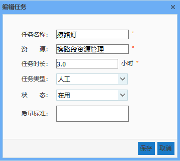
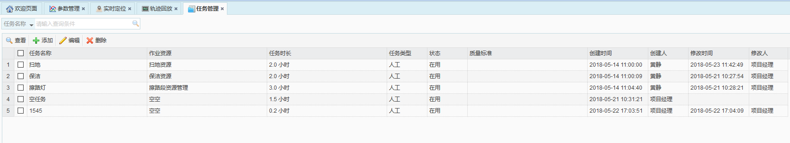

用于管理作业人员需要做的任务，比如：扫地、擦路灯、清理牛皮癣等等。
主要的操作：添加任务、编辑任务、查看任务、删除任务以及根据任务名称快速查询任务。
资源：表示作业人员在做这个任务时需要用到的工具，如：扫把、卫生夹等。
任务时长：表示做这件事大概需要多长时间。后续在做作业计划的时候，当天的作业时段添加的多个任务，任务时长合计不能超过当天计划的时段。

* **添加任务**
输入任务名称，选择任务类型，状态和质量标准，点击保存即可
任务类型分人工和机械。状态分：在用和停用。

* **编辑任务**
发现任务添加错了，可以对其进行编辑

* **删除任务**
选中一条任务，点击删除即可。

* **搜索任务**
根据任务名称进行查询，在任务名称栏输入任务名称，点击搜索
