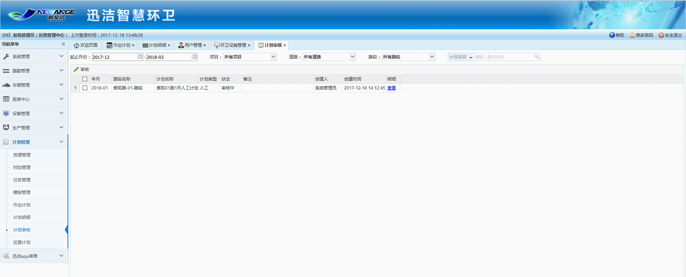
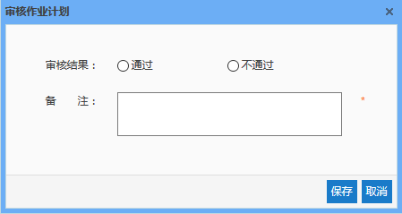

该模块主要是用于审核计划主管已经提交审核的计划。可以根据项目的起止月份、项目、道路、路段和计划名称进行查询

* **审核**
查看该计划的创建人，以及计划明细，是否合理。选中这条计划，点击审核

选择审核结果，输入备注信息，点击保存即可。
如果审核通过，此时该计划的创建人如果登录迅洁app会收到一条消息：您的计划已通过审核，请尽快下发，此时作业计划的状态为：审核通过。
如果审核不通过，此时该计划的创建人如果登录迅洁app会收到一条消息：您的计划未通过审核。此时作业计划的状态为：审核失败。审核失败的计划需由计划主管重新编辑计划，重新提交审核。

* **查看计划明细**
列表右侧的明细列，点击查看，可以查看该计划的所有明细。
