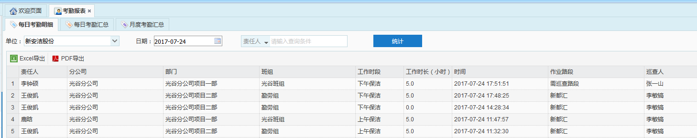
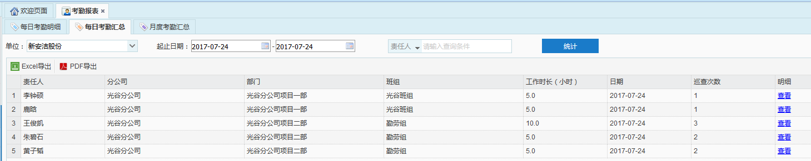
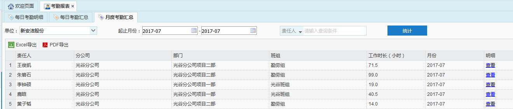

考勤报表分为每日考勤明细、每日考勤汇总和月度考勤汇总3个部分。
* **每日考勤明细**
每日考勤明细中显示责任人在每一次巡查结束后的考勤结果，若在巡查过程中，路段得分超过工时给予线或责任人在岗，即扫描到责任人信息时，则给责任人相应工时；若在巡查过程中路段得分低于工时给予线，且责任人不在岗时，不给责任人相应工时，即工作时长显示为0。

             
图 3.5‑43每日考勤明细报表
* **每日考勤汇总**
每日考勤汇总中显示的是责任人一天所获得的工时信息，若在一天的某一工作时段内进行过多次巡查，只选取工作时长最长的一次作为该时段的考勤工作时长来进行统计。
点击每日考勤汇总中某一条记录后的查看按钮，可跳转到每日考勤明细报表中查看该责任人在该天的考勤明细

             
图 3.5‑44每日考勤汇总报表
* **每月考勤汇总**
每月考勤汇总中显示的是责任人一个月所获得的工时的总和，点击某一记录后的查看按钮，可跳转到每日考勤汇总中该责任人在该月每天的考勤汇总。

             
图 3.5‑45每月考勤汇总报表
**以上报表中均可将查询出的结果以Excel或PDF的形式导出。**