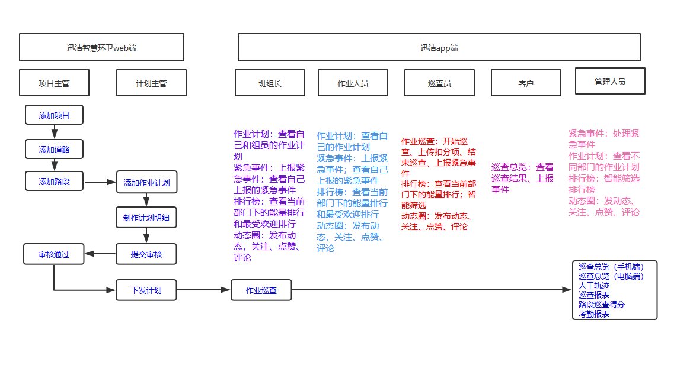
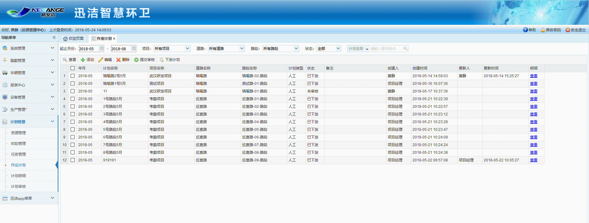
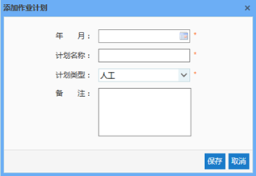
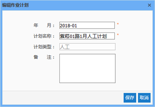
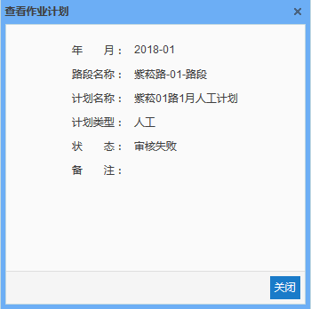
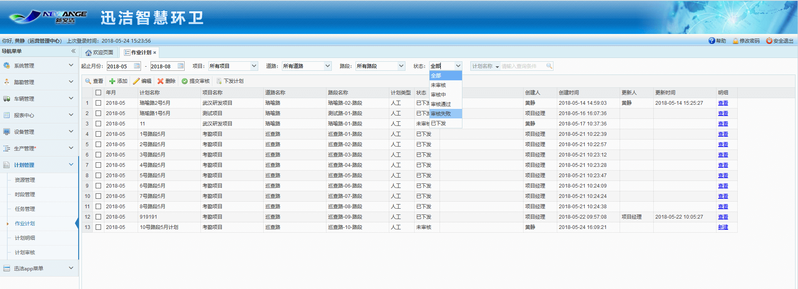

作业计划，主要是有作业主管针对不同的作业路段，添加作业计划，制作计划明细，提交给生产主管进行审核，审核通过后下发计划。计划下发后，作业人员和巡查员登录迅洁app即可查看与自己相关的作业计划。
计划的5种状态：未审核、审核中、审核通过、审核失败、已下发。

* **添加作业计划**
首先选择一个项目，再选择项目下的道路，再选择道路下的一条路段，点击添加，
再选择所做计划的年月，输入计划名称，选择计划类型，点击保存即可。
此时的作业计划处于未审核的状态。

* **编辑作业计划**
注意：只能对未审核和审核失败的计划进行编辑，其他状态下的计划均不可编辑。
		且编辑作业计划时，不可对计划类型进行编辑。原因是：不同的计划类型对应不同类型的计划模板，如果该计划已经新建了模板，再来编辑计划类型，则计划类型和模板的类型无法对应，故不能更改计划类型。

* **提交审核**
选中已经添加好明细的作业计划，点击提交审核。如果该项目的生产主管登录了迅洁app，则会收到一条消息：您有一条新的计划未审核。
此时，作业计划处于审核中的状态。生产主管登录系统，进入计划审核，出现一条待审核的数据。计划审核将在4.5.18计划审核里详细说明。

* **下发计划**
只有计划审核通过之后，才能下发计划，选中审核通过的计划，点击下发计划，
此时，作业计划处于已下发的状态。作业人员和巡查员登录迅洁app均可查看与自己相关的所有的已下发的计划。
注意：已下发的计划不得进行任何更改。

* **查看作业计划**
选中一条计划，点击查看。

* **删除作业计划**
选中一条计划，点击删除即可。
注意：已经提交审核的计划，无法删除。

* **根据状态进行过滤作业计划**
选择计划的任意一种状态，则作业计划列表中只显示该状态的作业计划。
根据计划名称进行搜索计划，在计划名称处输入计划名称，点击搜索即可快速查找到该计划。

