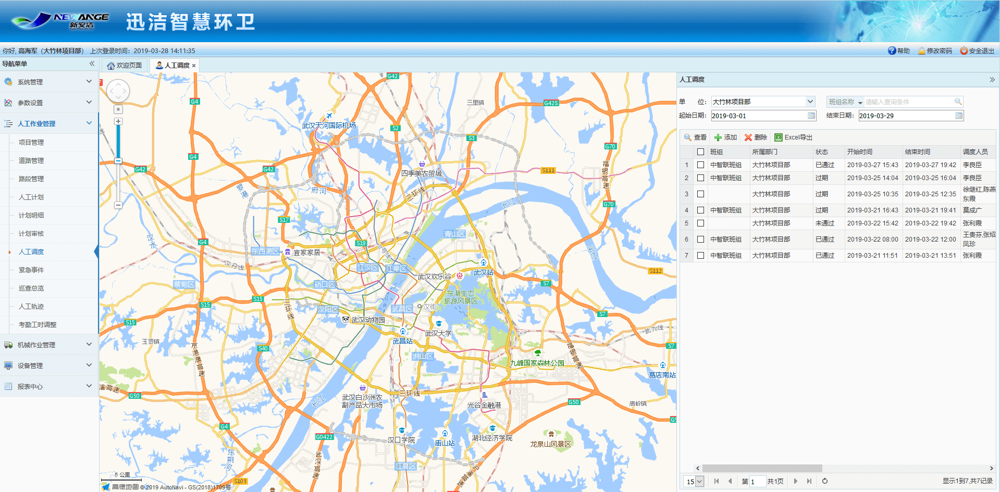
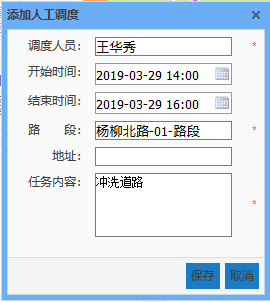
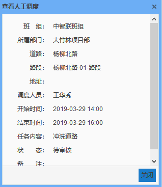
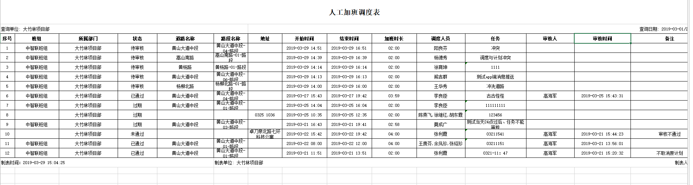

 具有人工作业管理\-人工调度菜单权限的人可以在pc端进行人工调度。
管理人员根据生产需要进行人工调度，选择一个或多个人员在几点至几点到某个路段或者未划入路段的某个地址去完成一项任务。人工调度无需巡查，由项目经理审核通过并且时段过了将自动生成考勤。（调度任务的四种状态：创建调度后，是**待审核**的状态，审核通过后是**已通过**的状态，若审核不通过则是**不通过**的状态，如果在调度任务的当天24:00依然未完成审核操作，则是**过期**的状态，不得再次审核。也就是说调度任务开始后当天内依然是可以审核的。）

* **添加调度**
             选择或者输入下图的调度信息，点击保存即可，app端会收到待审核的消息推送。

             冲突的情况：1.调度与调度冲突，该员工在该时段已经有调度任务了，则该调度不允许创建。

             2.调度与计划冲突，则提示是否取消原计划创建调度，可以选择提交并取消原计划，或者提交不取消原计划。如果提交不取消原计划，则该员工可以得到原计划和调度的考勤。如果提交并取消原计划，则该员工只能获得调度的考勤。

* **删除调度**

* **查看调度**

* **Excel导出**
