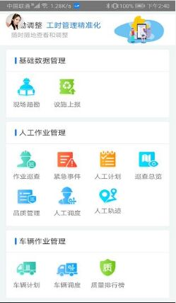
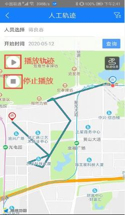
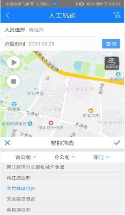
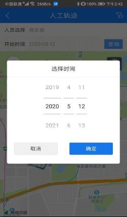
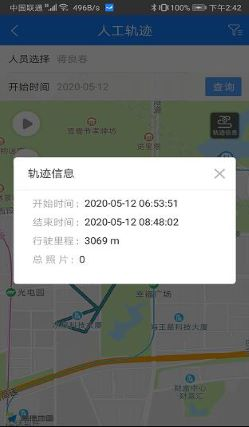

## 人工轨迹
1. 同web端功能一致，展示登录迅洁app的人员在签到和签退之间的轨迹；
2. 先选择人员--选择日期--点击查询按钮，即可查看该用户在本日内的轨迹；
3. 人工轨迹的巡查轨迹部分区分显示；人工轨迹紫色显示、巡查轨迹绿色显示；
4. 轨迹定位点时间间隔是5分钟；
5. 多级巡查人员如果没有签到，则巡查了也不会有轨迹；
6. 与web端不同的是，app端一次只能查询一个人的轨迹，而web端一次可以查询多个人的轨迹。
7. 点击播放轨迹，则开始播放轨迹；点击停止，则停止播放。
8. 点击轨迹信息，可以查看该段轨迹的开始时间、结束时间、里程、总照片数。
9. 点击右上角的筛选按钮，可以筛选部门，查看某个部门下的人员的轨迹。

  