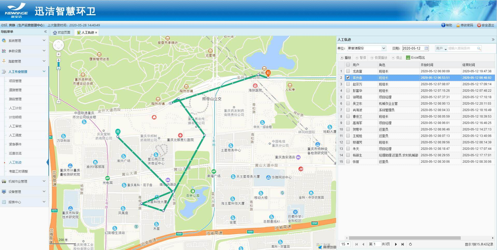

## 人工轨迹
1.可以查看所有人人员的轨迹，前提是用户登录了迅洁app。可以同时展现多个人的轨迹。
2.①多级巡查，签到才有轨迹，没签到就没有轨迹，多级巡查员没有签到签退，即使巡查了也没有任何轨迹；
` `②日常巡查，没有签到就只记录巡查轨迹；
` `③无巡查权限人员，按签到签退记录轨迹；
` `④只签到不签退，系统自动在当天晚上12点停止定位点上传，签到签退记录里没有签退记录。
3.查询步骤：点击选择用户输入框，选择要查询的人员，选择日期（默认当天），点击查询即可。
4.右侧列表选中一条数据后，地图上才会出现相应的轨迹，点击播放，地图上的小人开始按照轨迹行走。
5.巡查轨迹是5分钟上传一个定位点，将期间的定位点连接成轨迹，故轨迹可能存在不精确，稍有偏差都是正常现象。
6.人工轨迹整体紫色路线；巡查轨迹绿色路线显示。
