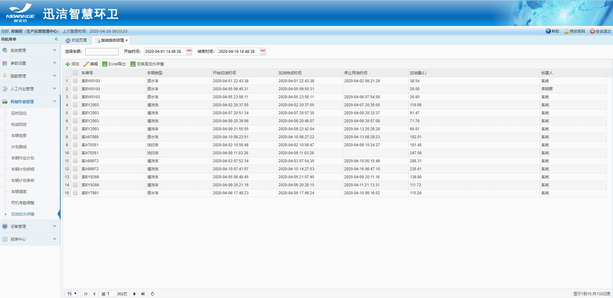
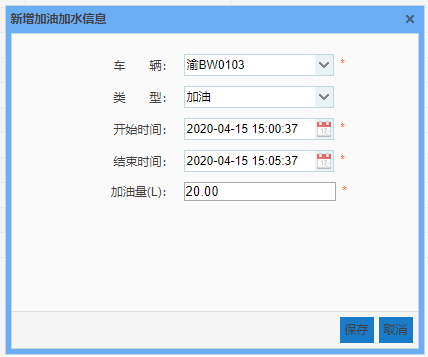
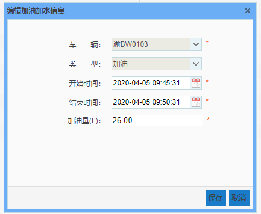
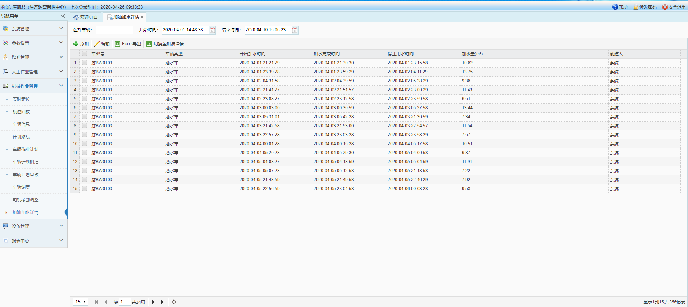

加油加水详情主要是对一段时间内车辆的加油积水情况进行统计，并可手动添加某个车辆的加油加水数据，实现查询、添加、编辑、导出等功能的操作。
注：手动添加的加油加水详情-【创建人显示：登录者姓名】，自动监测的加油加水详情-【创建人显示：系统】

 *  **添加加油加水信息**
 点击【添加】按钮 - 弹出【新增加油加水信息】对话框 - 选中或输入车辆的【车牌号】，选择【车辆类型】和【开始时间、结束时间】，输入【加油量】或【加水量】- 点击【保存】- 弹出【添加成功】提示语。
注：开始时间不得晚于结束时间

* **编辑加油加水详情**
选中一条加油或加水信息 - 点击【编辑】按钮 - 弹出【编辑加油加水信息】对话框 - 可修改开始时间、结束时间、加油量或加水量等信息 - 点击【保存】- 弹出【更新成功】提示语。

*  **Excel导出**
通过选中车辆、调整时间来统计一段时间内一辆车或多辆车的加油详情或加水详情 - 点击【导出】按钮 - 即可导出该段时间内该车辆的加油详情表或加水详情表。
* **切换至加水/加油详情**
当前显示的车辆一段时间内的加油详情信息 - 点击【切换加水详情】按钮 - 即可统计当前车辆一段时间内的加水详情信息。

