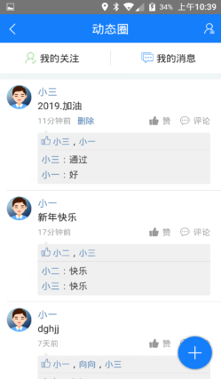
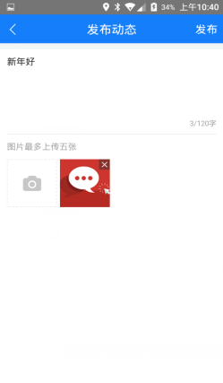
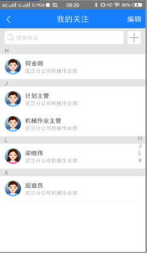
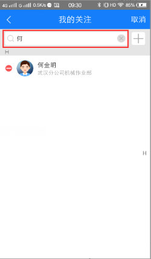
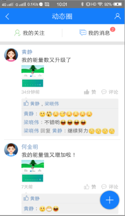
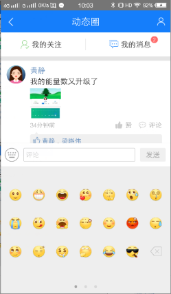
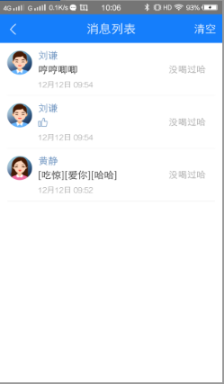
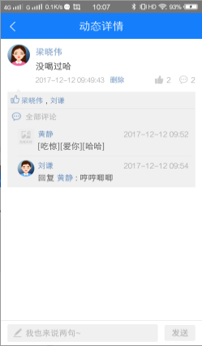
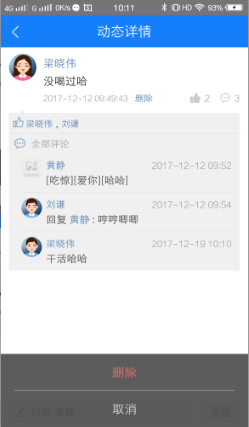
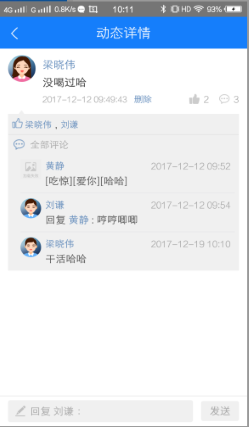

## 动态圈
动态圈功能，系统对内部所有员工均开放，除客户不具备动态圈功能外，其余所有员工都具备。
动态圈里默认显示已关注的人的所有动态。
动态圈主要用于内部员工发布动态、点赞和评论、我的关注、查看消息列表、进入我的主页等。
* **发布动态**
进入动态圈，点击“+”进入发布动态，输入内容，上传图片，点击发布即可。
返回动态圈即可看到自己发布的动态，自己也可以给自己点赞和评论
也可删除自己发布的动态。

* **进入我的主页**
点击动态圈右上角主页图标，即可进入我的主页。
* **我的关注**
* 1．	查看我的关注列表
用户有一个默认的关注人员列表，即用户在web端被创建时，就默认关注了当前所在部门下的所有员工。当有新员工加入到该部门下后，老员工会自动关注他，他也会关注老员工。**关注列表实行强制关注，不允许添加或者删除人员。**
* 2．	通过姓名首字母快速检索已关注的人员
我的关注列表右侧有大写字母，滑动或点击字母，可以快速检索到以该首字母开头的用户。
* 3．	通过姓名快速搜索关注列表里的人
在搜索姓名栏输入姓名的任意一个字，关注列表即可显示含有该字的人员。
  
* **点赞和评论**
对好友的动态进行点赞和评论，如图，收到点赞和评论后，我的消息显示红色的消息条数
注意：发布动态无法发布表情，只有评论时可以输入表情，且只能使用自带的表情，不能使用输入法的表情。

* **查看我的消息列表**
点击我的消息，进入消息列表，可以清空消息列表，也可以点击消息进入消息详情。

* **查看动态详情**
动态详情显示该动态的点赞数和评论数，可以删除自己发的动态，可以点赞和取消点赞、评论和删除自己的评论、回复评论等操作。
取消点赞，只需再次点击点赞图标即可。
删除自己的评论，只需点击自己的评论，再点击删除即可。
回复评论，点击别人的评论，输入框会显示“回复某某”，输入评论，点击发送即可。

