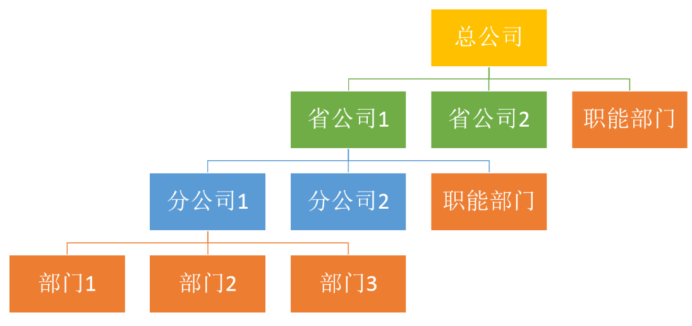
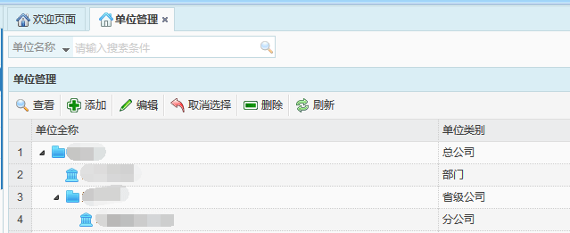
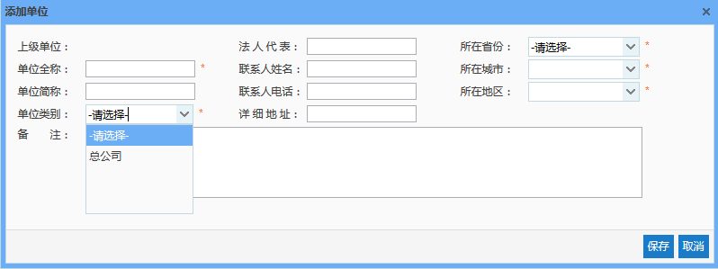
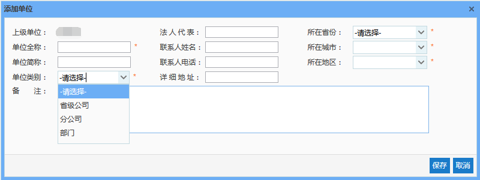
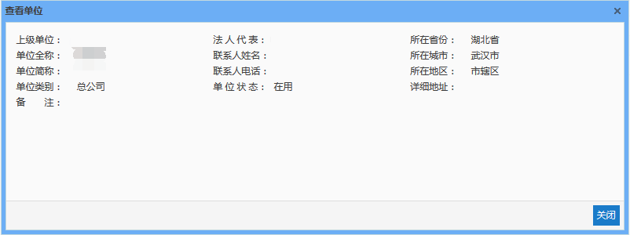
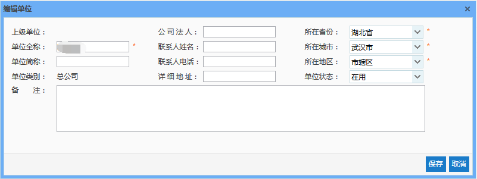

单位级别划分为4个层次，依次为：总公司、省公司、分公司以及部门，部门为最小单位，如下图所示：

图 3.1 3单位组织结构
单位管理主要是对单位的查看、添加、编辑以及删除。系统中已添加部分基础数据，可在该数据的基础上进行增删查改。
 
图 3.1 4单位管理界面
* **添加单位**
直接点击【添加】按钮，弹出添加单位对话框，此时上级单位项显示为空，即无上级单位，并且单位类别只有“总公司”选项。也就是说，直接点击【添加】按钮，将创建一条总公司数据。
注意：输入框后带有“ * ”的表示必填信息，如不填写则无法进行保存。
 
图 3.1 5添加单位1
选中一条单位类别为总公司的单位数据后，点击【添加】按钮，仍会弹出添加单位对话框，此时上级单位项显示为选中的单位的名称，且单位类别中可选项为省级公司、分公司以及部门，即总公司下面的任一单位类别均可被选择。也就是说，添加的单位可以是上一单位级别下的任一单位类型，但部门为最小单位，也就是说部门下无法再添加单位。
 
* **查看单位**
选中一条单位数据，点击【查看】按钮，弹出查看单位对话框，即可查看该单位的全部信息。
 
* **编辑单位**
当已添加的单位信息存在错误或遗漏时，可通过编辑单位功能，实现对单位信息的更正。
选中一条需要编辑的数据，点击【编辑】按钮，弹出编辑单位对话框，即可对该单位信息进行编辑。其中，单位类别无法进行修改。
 
* **取消选择**
当需要添加单位类别为总公司的单位信息时，可通过点击【取消选择】按钮，取消对单位数据的选择。
* **删除单位**
选择一条数据后，点击【删除】按钮，即可删除该单位及该单位下的全部单位数据。需要注意的是，当删除的单位中的部门存在班组、角色或用户等数据时，将无法删除。
该功能的目的是为了删除当前添加出错的单位，若某一单位不再进行使用之后，建议通过【编辑】功能，将其状态设置为“停用”。单位停用后，其下级单位也将停用，该单位下的班组、角色和用户将不在系统中展示。
* **刷新**
点击【刷新】按钮，可对单位列表信息进行刷新。
