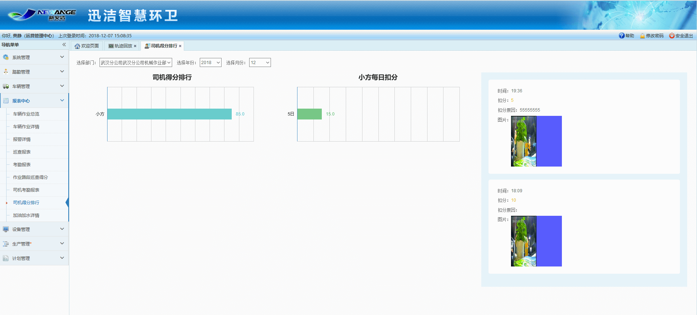

             
机械作业主管在轨迹回放里查看定位点照片时，进行评分，统计司机的作业质量
得分情况。如果没有进行评分则默认满分100分。
备注：评分时，查看的定位点照片时间点，在计划时间或调度时间内，可进行评分；在计划时间和调度时间外，不可进行评分。
评完分后，在该评分的车辆计划和车辆调度时间内，司机打卡，评分归打卡司机；司机未打卡，评分暂时归车子，考勤调整后，把扣分绑定到调整的司机。
每个司机一个月有100分，每日扣分将会累计，当月100减去每日扣分累计\=当月的得分。轨迹回放始终可以扣分，当一个司机扣分超过100，则显示0分，每日扣分会详细显示扣分情况，得分低于0显示0.
同时，迅洁app的质量排行榜显示与web端司机得分排行显示一致。Web端右侧显示定位点照片及扣分详情。点击图片可查看大图。
