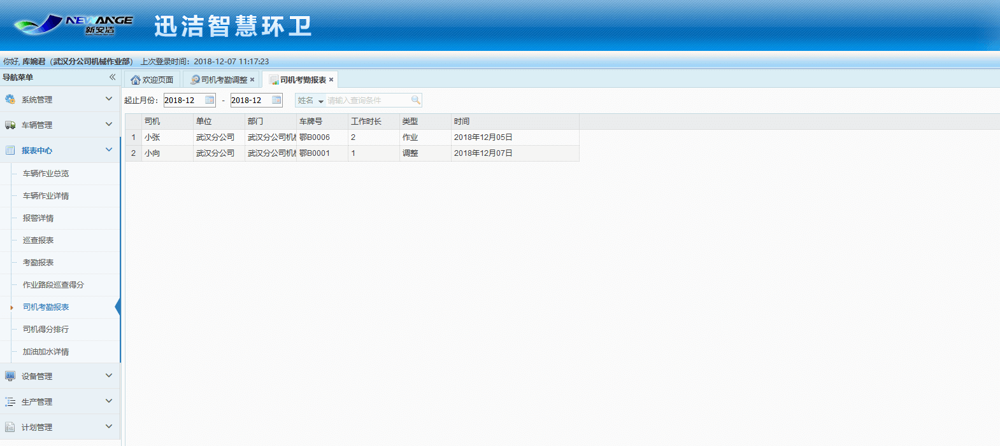

司机考勤报表是指司机根据计划，在计划时间内工作时，在车载终端上进行打卡，生成的考勤记录，得出的司机考勤报表。

             司机考勤报表分为3种类型：
1 作业类型，根据作业计划，在工作时间内进行打卡并且有轨迹点，生成的司机考勤。
2 调整类型，根据司机考勤调整，针对已处理了的司机考勤调整记录，生成的司机考勤。
3 调度类型，根据调度计划，在工作时间内进行打卡并且有轨迹点，生产的司机考勤。