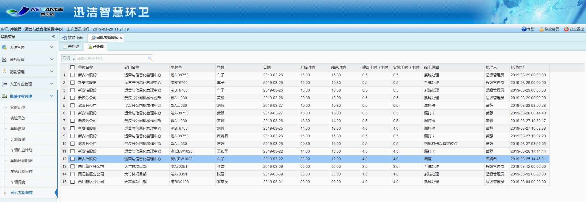

 主管取消计划或取消临时计划时，就会生成司机考勤调整，其中当天取消的考勤调整需在第二天才会生成。
（1）司机未打卡（时段内）并且车辆在作业时段内有由轨迹点（100个基准）则生成异常考勤  
（2）司机打卡（时段内）但是车辆在作业时段内无轨迹点则生成异常考勤  
（3）未处理考勤：  
1）如果当天是在当月15号之前，则显示上个月到当天为止的异常考勤。  
2）如果当天是在当月15号之后，则显示当月的异常考勤。  
3）处理异常考勤的时候，需要将调整的司机绑定到该计划明细并且，如果该计划明细有扣分情况则需要将司机绑定扣分  
（4）已处理考勤：  
1）定时器处理三天未处理的异常考勤记录（只包括在时段有司机打卡但是车辆没有轨迹点的情况）

* **司机考勤处理**
             在未处理标签页下可查看待处理的考勤记录，选择一条需要进行处理的考勤记录，点击处理按钮，弹出司机考勤处理对话框，即可进行司机考勤的处理，司机考勤处理主要有2种情况：
1.在3天内不处理司机考勤记录，这种情况下，会按照建议工时，给予相应的司机考勤工时；
2.在实际工时输入框填写：工时时间、选中给予原因，这种情况下，按照填写的实际工时时间，来给予相应的司机考勤工时。如果填写的实际工时为零，则不会给予该司机考勤工时。

             在时间段内，无司机打卡，有轨迹点时的异常考勤，系统无法默认处理，只能手动处理司机考勤。

* **司机考勤调整记录查看**
             在已处理标签页下，可查看已经处理了的司机考勤调整记录的详细信息。
