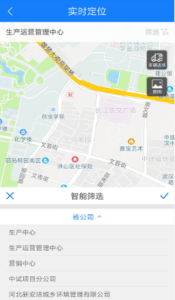
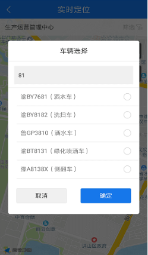
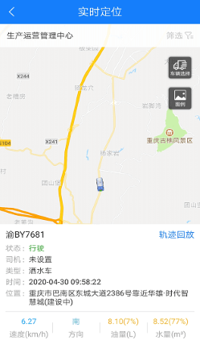
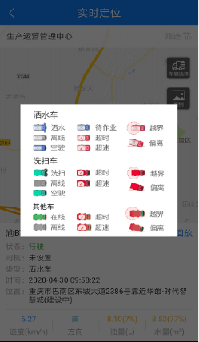

## 实时定位
实时定位是对车辆所在位置及车辆状态信息的实时展示，其中包括车辆当前位置、速度、方向、油量、水量，也包括车辆在线、车辆离线以及车辆报警等状态，。目前，报警状态包括车辆超速、车辆越界以及车辆停车超时。
* 筛选部门：点击筛选，选择一个部门，确认后字体弹出车辆选择框，选择一个或者多个车辆，可以在地图上点击车辆，展示车辆当前的实时信息。

* 选择车辆：可以输入车牌号快速搜索车辆

* 查看图例：不同类型的车辆及不同作业状态下的车辆在地图上展示对应的图标，辅助看懂地图上的车辆小图标。

