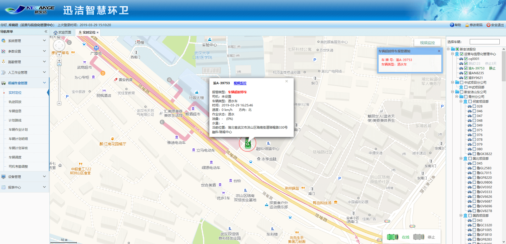
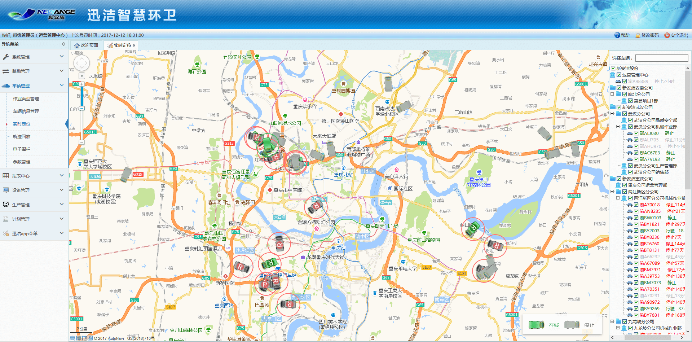
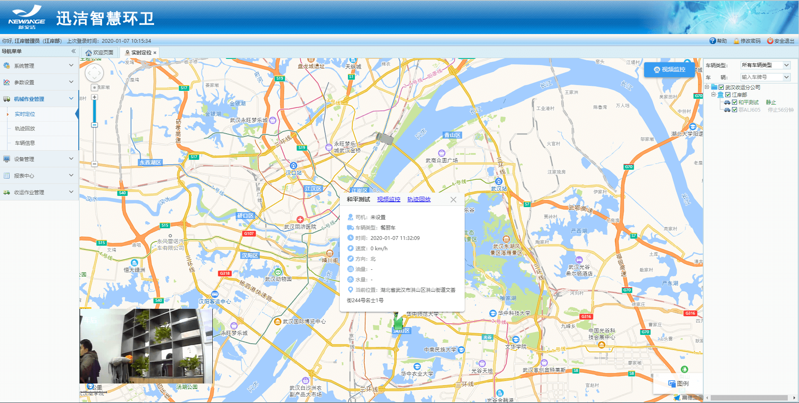
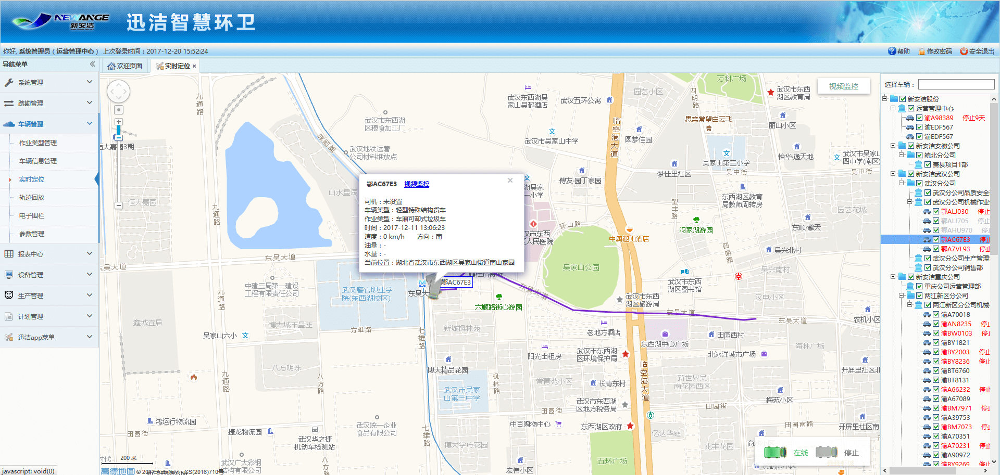
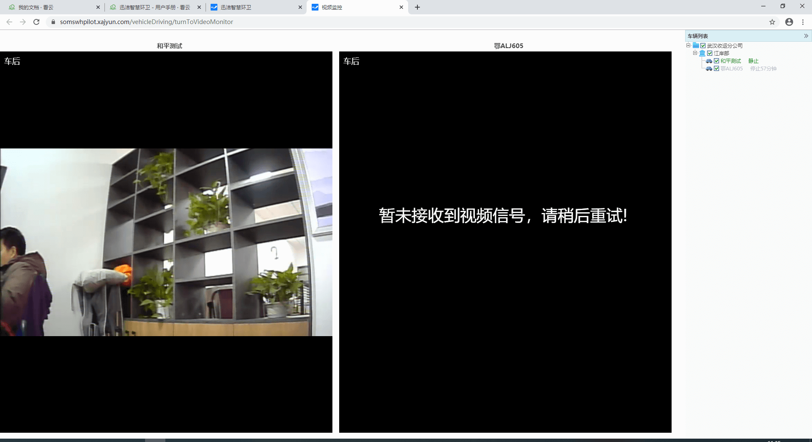
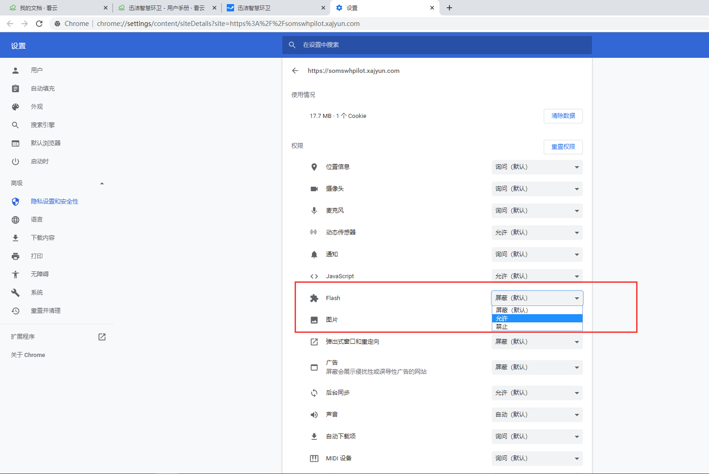

实时定位是对车辆所在位置及车辆状态信息的实时展示，包括车辆在线、车辆离线以及车辆报警等状态。目前，报警状态包括车辆超速、车辆越界以及车辆停车超时。
注意：实时定位的车辆列表，不展示停用状态的车，也不展示未绑定车载终端的车辆，展示的车辆绑定的车载终端的状态也必须是在用，闲置废弃等不展示
**越界：指车辆的当前位置超出电子围栏划定的区域；
行驶：车辆在行驶中。实时定位中标记为“在线”状态，并显示车辆行驶速度。
静止：车辆启动，但未行驶，车辆的速度为0。实时定位中标记为“在线”状态，“在线”状态的车辆均显示绿色字体。
停止：车辆停止工作，熄火。超过5分钟，实时定位中显示“停止xxx小时”，字体显示灰色，
停止超过7天，用红色字体显示。
离线：终端没有心跳，车辆失去连接，且未超过7天，用灰色色字体显示。
未定位：从未上传过定位数据或者车辆离线超过30天，车辆用黑色字体显示，无法查看实时定位信息。**

在该页面可进行的操作如下：
进入实时定位模块，地图自动定位到全部车辆所在区域，右侧树中显示权限范围类的全部车辆。
1. 点击右侧树中某一车辆车牌号，地图自动定位到该车辆，在车辆周围显示出该车辆的车牌号，且弹出车辆状态信息框，可查看该车在该点时的状态信息，包括时间、速度、方向、油量、水量及当前位置信息。

2. 右侧树中的复选框可控制是否在地图中显示该车的定位信息，默认全部勾选，即地图中显示全部已定位的车的图标，取消勾选后，地图中将不再显示该车的定位信息。
3. 点击地图中车辆图标，同样可弹出车辆状态信息框，并查看相关信息。
4. 点击选择车辆后的输入框，弹出选择车辆对话框，勾选需要查看的车辆的信息，点击【确定】按钮后，地图自动定位到该车辆，且弹出车辆状态信息框查看相关信息。
当车辆出现报警信息时，地图右上角会弹出报警通知弹框，且地图中该车图标显示为报警状态。其中，图标中的字母S为车辆超速，P为车辆停车超时，R为车辆越界。

5. 点击地图上的车辆，会弹出车辆状态信息框，点击视频监控，可以查看车辆实时的监控视频
注意：同一辆车10S内不可重复查看视频监控；合宙GPS终端无法观看视频，没有视频监控的链接

6. 新增车辆作业状态：分洒水车和洗扫车。
（1）如果该车辆的车辆监控类型是：暂不选择，则实时定位车辆信息框不会展示车辆作业状态；
（2）如果车辆监控类型是：检测洒水车状态，则实时定位车辆信息框会展示洒水的8中作业状态：左前洒水、右前洒水、左后洒水、右后洒水、左对冲水、右对冲水（或组合状态）、待作业状态（取力器开启、副发动机开启）、空驶。
（3）如果车辆监控类型是：检测洗扫车状态，则实时定位车辆信息框会展示洗扫车的2种状态：洗扫和空驶。

7. 在右侧车辆列表，随意点击一辆车，会显示该车5分钟内的轨迹，如果看不到，需放大地图。注意：是点击车牌号，而不是勾选框。

8. 点击地图右上角实时监控，可最多同时查看4车的实时监控视频。注意：依然是点击车牌号查看视频监控，点击车牌号，勾选框会自动勾上；再次点击车牌号会取消勾选，则不再显示该车的监控视频。

**注意：如果出现无法看到视频，如下图这种情况**

点击浏览器地址栏的锁，将flash插件设置为默认允许，然后刷新页面即可。
