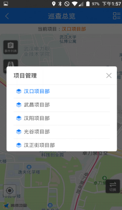
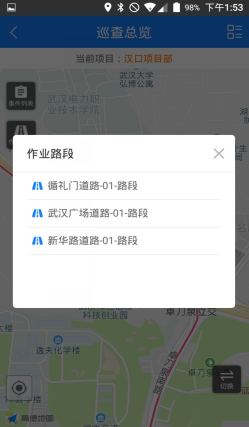
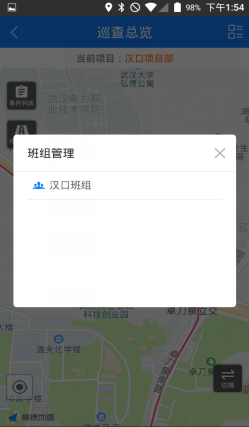
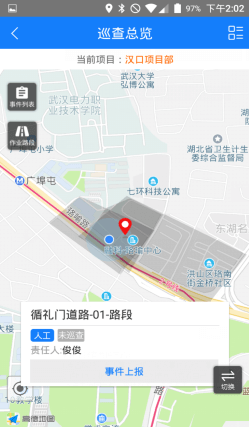
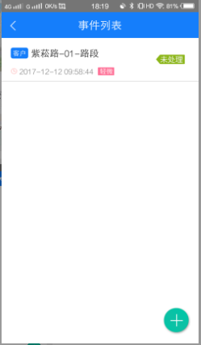
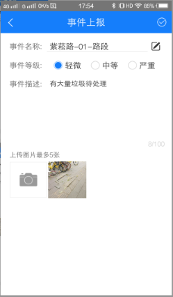
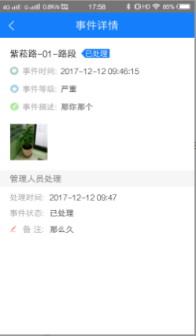

为客户提供路段巡查结果的展示，以及让客户对作业结果给出建议。
* **查看被授权的项目**
客户登录迅洁app，进入巡查总览，可以查看被授权的项目及项目下所有的路段
点击右上角的查看项目的图标，可查看自己被授权的项目
点击左侧作业路段，可以选择作业路段，并查看路段的巡查结果。如果该路段被巡查过，地图上路段的颜色会根据巡查得分情况显示不同的颜色，并显示巡查结果：优、良、合格、不合格。

* **事件上报**

事件上报有两种方式：
1.点击路段，点击事件上报，输入事件名称、事件等级、事件描述并拍照上传，点击上传即可上报成功。在事件列表可以查看自己上报的紧急事件。
2.点击地图左侧，事件列表，点击点击 ”+”，可以进行事件上报，点击选择路段按钮，选择当前所在的路段，选择事件等级，作业人员根据事件严重等级自行选择事件等级，输入事件描述，并拍照上传，点击右上角的上传，紧急事件即上报成功。
