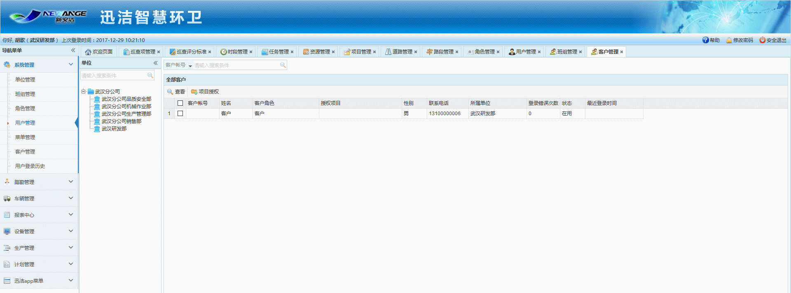

* **客户管理**
客户管理里只显示有客户角色的用户，客户的添加需在用户管理里，添加好后需授权为客户角色，才会在客户管理里显示
注意：客户角色的菜单授权只有 巡查总览-客户
  
* **查看客户**

* **授权项目**
选择一个客户，点击授权项目，授权后，该客户登录迅洁app即可查看巡查总览
详见客户篇-巡查总览。
注意：由于添加客户时，姓名和联系电话是必填项，登录迅洁app可以使用工号、账号和手机号，客户首次登录迅洁app没有账号，也没有工号，所以只能使用手机号登录迅洁app，登录后自行设置自己的账号，也可以不设置。
