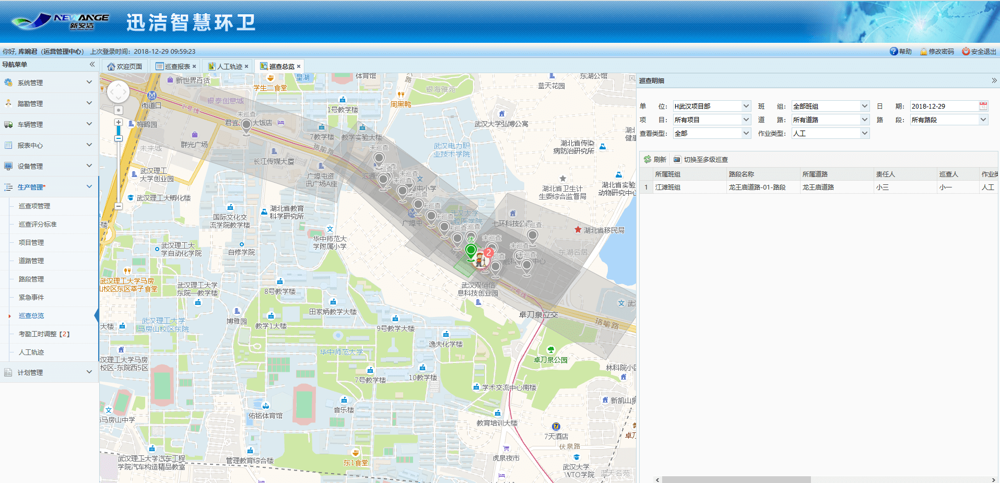
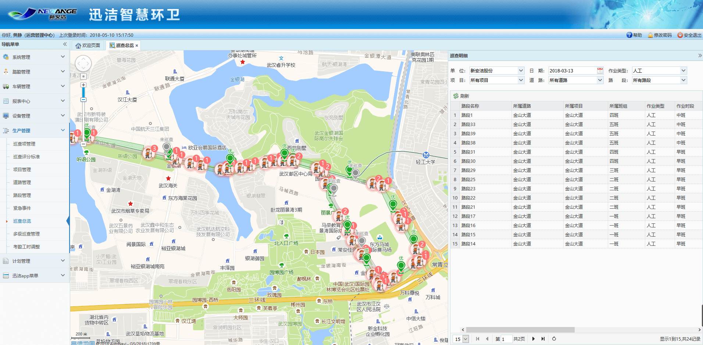
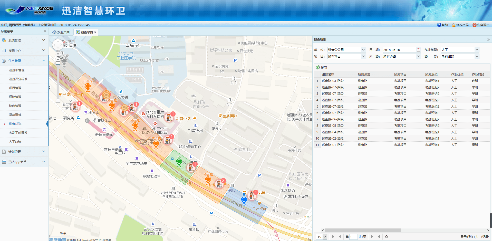
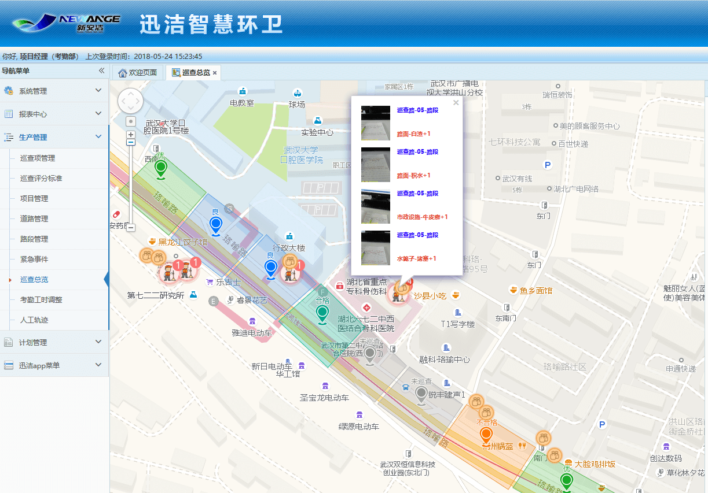
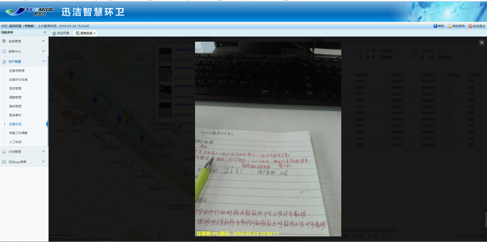

作业巡查总览中可直接在地图中对作业路段每天最后一次巡查的结果的查看，左侧地图中可查看路段信息、得分情况及在岗人信息，右侧列表中可查看该路段最后一次巡查的巡查明细，包括具体扣分的检查项信息。
可根据单位、日期、项目、道路及路段进行筛选查看，并可通过刷新功能查看最新结果。

1. 当巡查员结束巡查后，即可查看巡查总览，地图上会根据得分情况显示得分标准，分优（绿色）、良（蓝色）、合格（薄荷绿）、不合格（橙色）、未巡查。该得分标准是依据【巡查评分标准管理】的设置。
2. 并显示巡查过程中扫描到人作业人员，点击作业人员的头像可查看作业人员的详细信息，包括：员工的姓名、性别、电话、工牌编号、所在路段、作业类型、工牌的电量及是否与作业计划里的作业人员相匹配。
3. 右侧列表里显示巡查的路段、班组、时段、扣分项、巡查时间等等。
4. 点击地图上黄色不合格的图标，可以查看不合格出的拍照信息，再点照片，可以查看拍照大图，并且带有时间地点的水印

