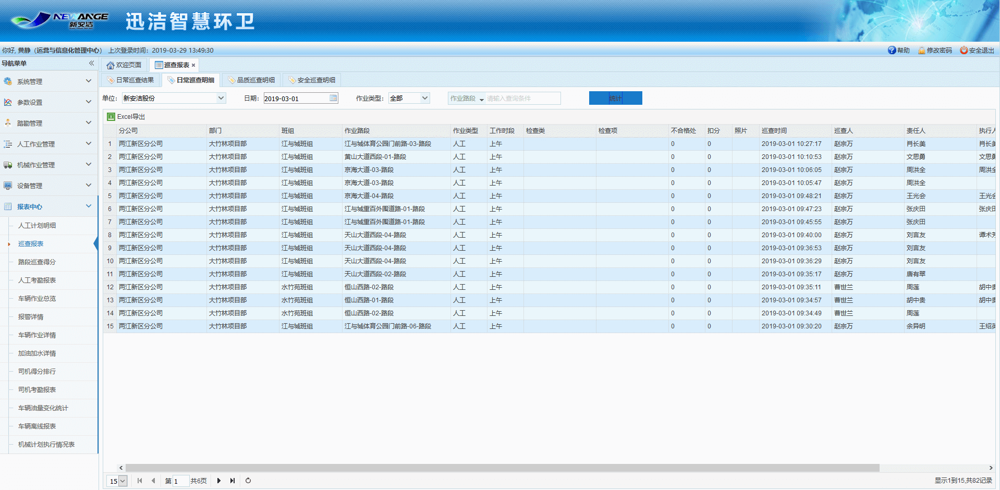
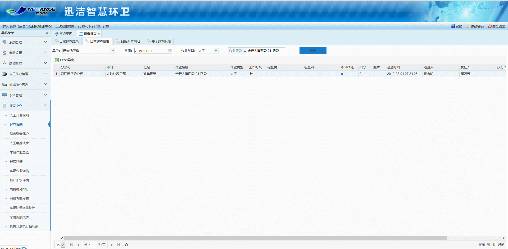
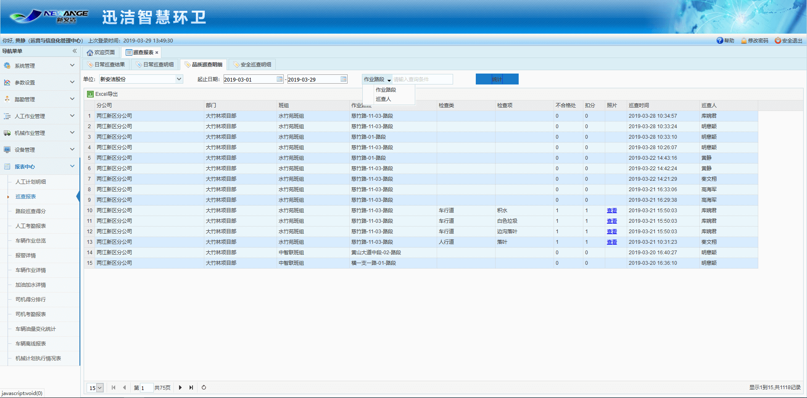
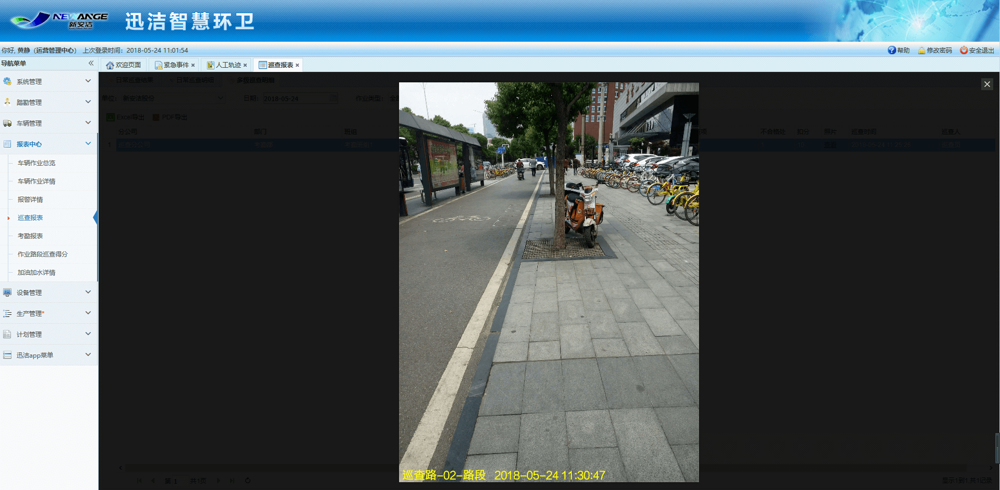

巡查报表分为日常巡查结果、日常巡查明细和品质巡查明细（品质巡查项的扣分情况）和安全巡查明细（安全巡查项的扣分情况）4个部分，其中，日常巡查明细中显示的是某一天中作业路段的每一次扣分明细内容，日常巡查结果中显示的是一段时间内某一条作业路段的最后一次巡查结果及得分情况。

可将查询出的结果以Excel的形式导出，点击日常巡查结果中某一路段信息后的查看按钮，可跳转到日常巡查明细中查看该路段该天的巡查明细。

注意：日常巡查明细、品质巡查明细、安全巡查明细的列表均有背景颜色进行区分，同颜色连续显示表示是一次巡查上报的问题，两种颜色隔开显示两次巡查上报的问题，易于区分。

日常巡查结果，可以根据巡查状态进行筛选，管理人员可以实时查看已巡查的路段和未巡查的路段。也可以查看巡查人、责任人、执行人及是否与计划匹配。

下图：点击查看链接跳转至日巡查明细。

下图：点击查看链接，可以查看不合格照片

