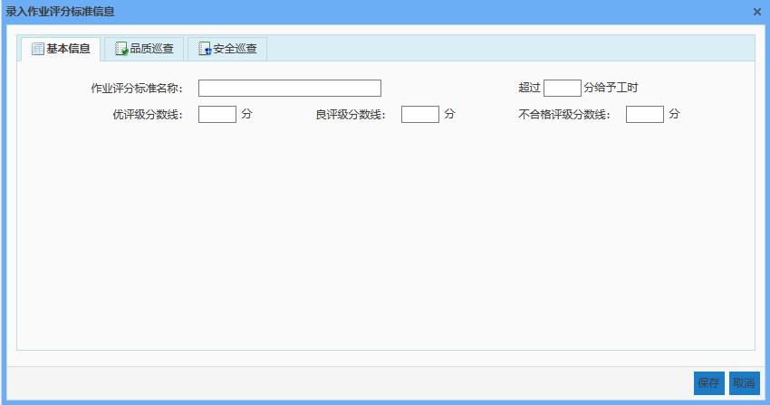
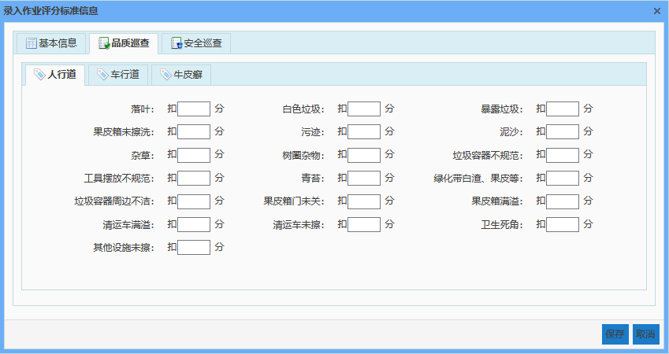
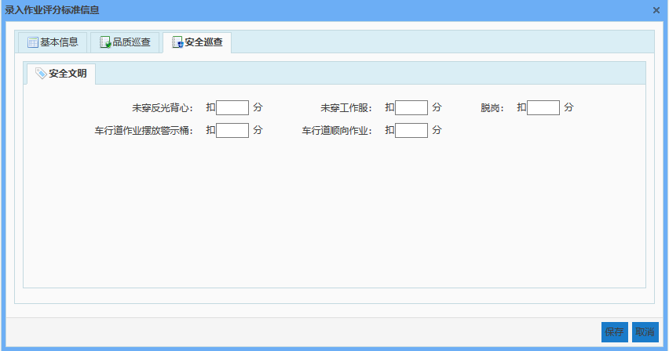
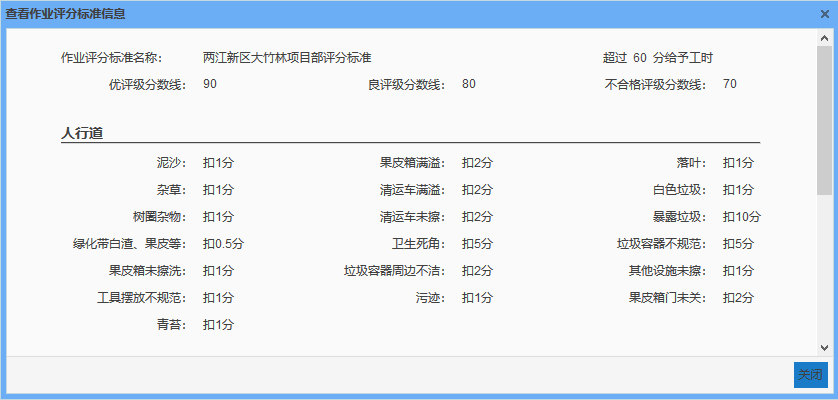
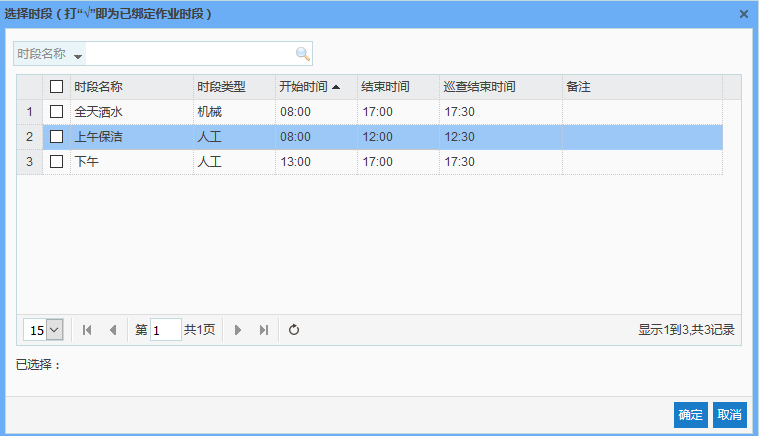

巡查评分标准管理是作业巡查的工作时段、巡查得分的等级划分、以及巡查项的扣分值设置的一个标准。由于每个项目的工作时段、巡查项的扣分规则可能不一致，需要做到可以为每一个项目单独设置其作业巡查评分标准。

* **添加作业评分标准信息**
点击【添加】按钮，弹出录入作业评分标准信息对话框，需要录入的信息分为2部分：基本信息和检查项的扣分值，输入相关信息后，点击【保存】按钮，即可成功添加作业评分标准信息。
其中，基本信息中评级分为优、良、合格、不合格。
优：大于优评级分数线；
良：小于优评级分数线且大于良评级分数线；
合格：小于良评级分数线且大于不合格评级分数线；
不合格：小于不合格评级分数线。
超过多少分给予工时：表示作业路段巡查结束后得分超过该分数后，无论该路段责任人在不在岗，即是否扫描到该责任人的工牌，默认会给该责任人相应工时；若作业路段巡查结束后得分低于该分数，只有当责任人在岗时，才会给责任人相应的工时。
检查类下可针对每一个检查项输入其扣分值，即发现一处扣几分。作业路段满分为100分，扣分值可输入范围0-100，可输入1位小数，作业路段最终得分范围为0-100分。

             
图 3.5‑7录入作业评分标准信息中基本信息

             
图 3.5‑8录入作业评分标准信息中扣分值

* **查看作业评分标准信息**
选中一条作业评分标准数据，点击【查看】按钮，弹出查看作业评分标准信息对话框，下拉滚动条，即可查看该作业评分标准全部信息。

 图  3.5‑9查看作业评分标准信息

* **编辑作业评分标准信息**
选中一条作业评分标准数据，点击【编辑】按钮，弹出编辑作业评分标准信息对话框，即可对该作业评分标准信息进行编辑。

* **删除作业评分标准信息**
选中一条车辆数据，点击【删除】按钮，即可删除该作业评分标准信息数据。
如果已有项目绑定了该评分标准，删除该评分标准后，项目与评分标准会自动解除绑定。

* **选择时段**
添加项目的时候，绑定了一个评分标准，评分标准需选择时段，则项目就间接的绑定了时段，在做作业计划的时间，时段只能选择该项目绑定的评分标准所拥有的时段。
选择一个评分标准，点击选择时段，勾选要绑定到该项目下的时段，点击确定即可。
选择时段页面可根据时段名称进行搜索。

