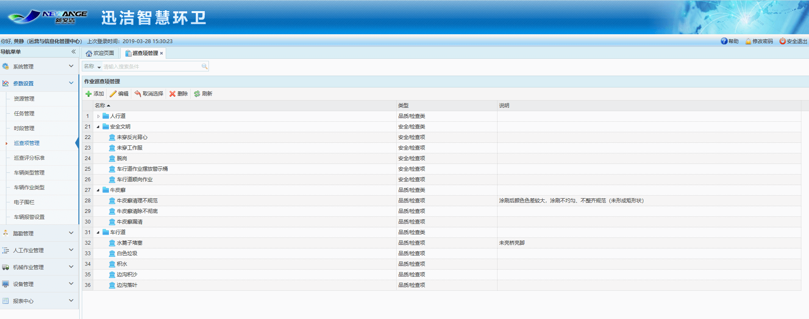
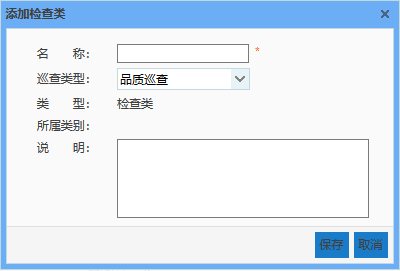
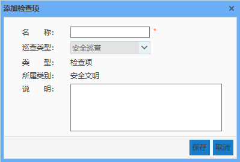
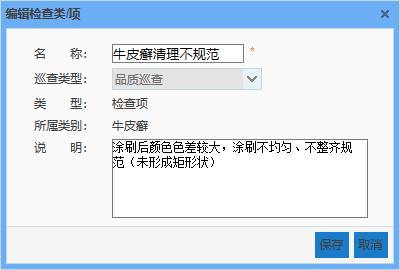

巡查项管理主要是对作业巡查过程中需要关注的检查类及检查项的管理，包括添加、编辑及删除等操作。该模块中添加的检查类及检查项在整个系统中都将通用，即在作业巡查评分标准模块中添加巡查评分标准时可对作业巡查项管理中添加的全部巡查项输入扣分标准。
 注意：巡查项分两类：安全和品质。安全检查类下添加安全检查项；品质检查项下添加品质检查类。

图 3.5‑3作业巡查评分标准界面
* **添加检查类**
不选择任何数据的情况下，点击【添加】按钮，弹出添加检查类对话框，类型显示为检查类，输入检查类名称及说明，点击【保存】按钮，即可实现检查类的添加。
注意：输入框后带有“ * ”的表示必填信息，如不填写则无法进行保存。

图 3.5‑4添加检查类
* **添加检查项**
选中需要添加检查项的检查类数据，点击【添加】按钮，弹出添加检查项对话框，类型显示为检查项，所属类别显示选中的检查类的名称，输入检查项名称及说明，点击【保存】按钮，即可实现检查项的添加。

图 3.5‑5添加检查项
* **编辑检查类/项**
选中一条需要进行修改的检查类或检查项数据，点击【编辑】按钮，弹出编辑检查类/项对话框，可对名称及说明做出修改，修改完成后，点击【保存】按钮，即可完成对检查类/项的编辑。

图 3.5‑6编辑检查类/项
* **取消选择**
当需要添加类型为检查类的数据时，可通过点击【取消选择】按钮，取消对数据的选择。
* **删除检查类/项**
选中一条需要删除的检查类数据，点击【删除】按钮，即可删除该检查类及其下全部检查项数据。
选中一条需要删除的检查项数据，点击【删除】按钮，即可删除该检查项数据。
* **刷新**
点击【刷新】按钮，可对巡查项列表信息进行刷新。
