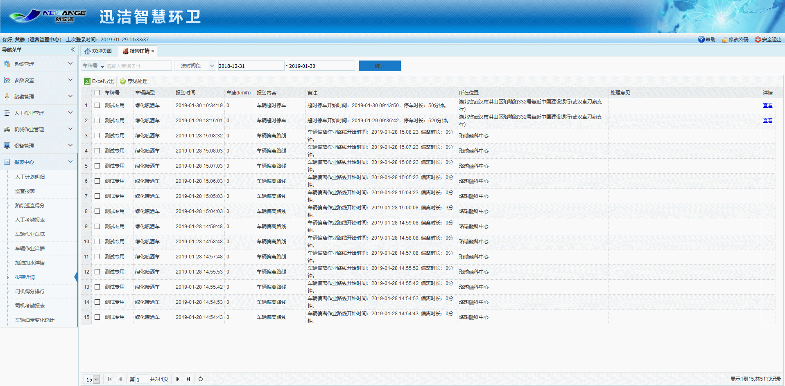

报警详情报表是对车辆运行不符合规范或车辆出现异常报警的信息的统计，并可导出Excel。管理人员查看报警记录时，可以添加处理意见。

* **统计**
报警详情报表中，可通过调整统计时间段，查询车牌号或报警内容等，来对一段时间内的指定报警信息进行统计。
* **Excel导出**
直接点击【Excel导出】按钮，可将当前统计出的报警详情导出为Excel文档。
* **查看详情**
针对报警类型为车辆超速、车辆超时停车或车辆越界的报警信息，可点击列表后的【查看】按钮，跳转至轨迹回放中结合地图查看其报警信息。
* **意见处理**
管理人员要对报警进行处理，选择一条报警数据，点击意见处理，输入处理的意见，点击确定即可。
