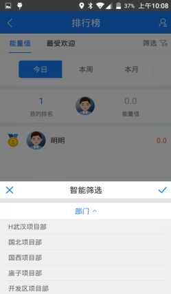
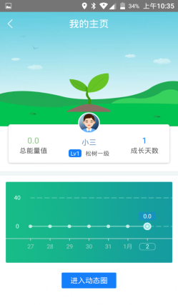

## 排行榜
主要用于查看自己所在部门下的员工的能量排行和最受欢迎排行。
能量值排行：针对的对象：具备多级巡查权限的人和作业人员（包括班组长）。
1.多级巡查员：在上班时间内（8：00-17：30）上传步数。由步数转化为能量值。
2.班组长：在该班组负责的所有有计划的路段内且时段内上传计步数据。
3.作业人员：在自己的上班时间内且路段内上传计步数据。
最受欢迎指的是在动态圈里，收到的点赞数。
注意：由于能量排行跟系统管理员无关，故系统管理员没有能量值，但具备智能筛选的功能，可以通过智能筛选查看自己所在的分公司下所有的部门的排行榜；系统管理员进入排行榜，默认显示当前所在部门下的所有员工的能量排行和最受欢迎排行。

* **智能筛选**
进入排行榜，点击智能筛选按钮，或右上角的灰色筛选图标，选择要查看排行榜的部门，点击“√”即可查看该部门下的排行榜
注意：只有管理人员才具备智能筛选功能。

* **查看能量排行榜**
能量排行榜，分今日、本周、本月的排行，点击头像可以进入他人主页。

* **查看最受欢迎排行榜**
最受欢迎排行榜，分今日、本周、本月的排行，点击头像可以进入他人主页，如果他人主页的右上角，点击可添加关注，如果已经关注，点击则可取消关注。

* **查看我的主页**
我的主页显示我的总能量值、能量等级、成长天数和近一周的能量折线图。还可以通过我的主页，点击进入动态圈按钮，进入动态圈。
注意：由于系统管理员无能量值，故系统管理员的主页基本空白。

