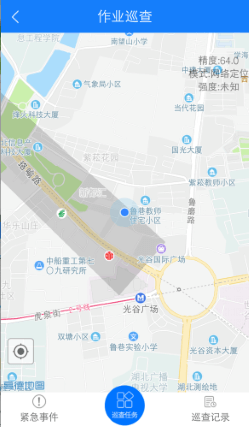
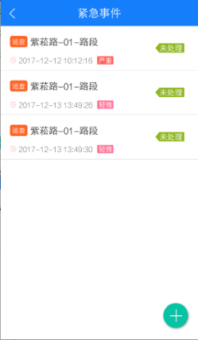
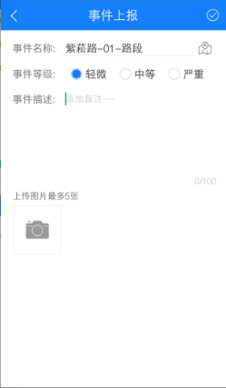
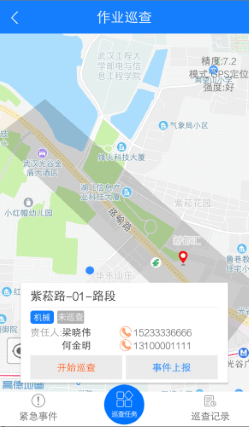
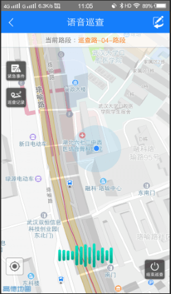
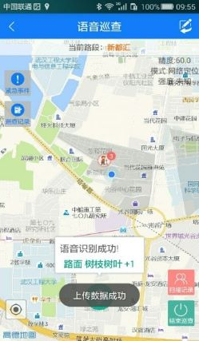
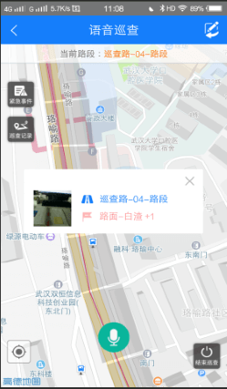
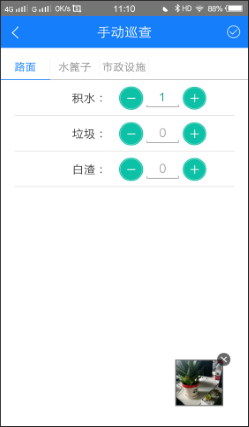
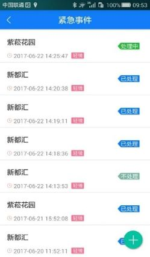
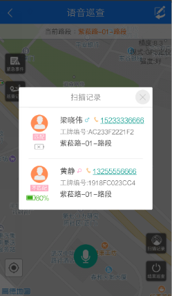

**日常巡查**主要是**班组长**通过迅洁APP对作业路段的清扫情况的检查，上传巡查过程中发现的不合格处和急需处理的紧急事件。每一位班组长都需要负责巡查自己班组负责的所有路段，如果出现没有巡查的情况，则考勤报表就不会有考勤数据。巡查记录在报表中心--巡查报表--日常巡查结果、日常巡查明细两张报表中体现。
* **作业巡查**
点击首页的“作业巡查”按钮，当手机已开启网络、蓝牙以及GPS的情况下，即可进入作业巡查页面，否则提示需先开启上述功能。作业巡查页面可上传紧急事件、查看并开始巡查任务、查看巡查记录等功能。

* **紧急事件**
点击紧急事件按钮，进入紧急事件列表页面，可查看该公司下已经上报过的紧急事件列表信息，点击“+”按钮，可添加新的紧急事件。

* **巡查记录**
点击巡查记录按钮，即可查看该巡查员的巡查记录。

* **开始巡查**
当到达某一作业路段内或其附近时，可开始该作业路段的巡查，开始巡查的方式有以下三种：
1.直接在地图中点击需巡查的作业路段区域，弹出该作业路段基本信息及“开始巡查”按钮标签，点击该标签，并在弹出的对话框中选择确定即可开始该路段的巡查；
2.点击底栏的“巡查任务”按钮，弹出巡查任务列表，在列表中点击需巡查的作业路段的名称，同样可开始该路段的巡查；
注意：如果当前不在巡查时段，则看不到开始巡查的按钮
3.巡查员进入某一作业路段区域后，APP语音提示已进入XX作业路段区域，是否开始巡查，语音输入开始巡查即可开始该路段的巡查。

* **语音巡查**
开始某一作业路段的巡查后，页面进入到语音巡查页面，即表示当前有路段正在进行巡查。在语音巡查页面可通过语音或手动输入上传不合格检查项数据、上传紧急事件、查看当天的巡查记录、扫描工牌并查看该工牌对应的员工的信息以及结束巡查。

**语音巡查**
在巡查过程中，当发现需要上传的不合格检查项项时，可通过语音输入“你好，小迅”来唤醒语音输入，当听到APP语音播报“你好”后，即可通过语音输入不合格检查项，输入规则为“【检查类】【检查项】【+n】”，例如输入“果皮箱，未关门，+2”，即表示发现2处果皮箱未关门的情况，语音输入成功后，APP会语音播报输入的不合格检查项的信息，**语音识别成功后，app立即跳转至拍照也，发现不合格项需要拍照为证。**

**手动巡查**
当周围环境嘈杂，无法很好进行语音输入的情况下，可点击页面右上角的“手动输入”按钮，进入手动输入页面，找到需要输入的不合格检查项，输入数量，点击页面右上角上传按钮，即可手动上传不合格检查项数据，输入不合格项之后，必须拍照才能上传，照片上都有路段和时间的水印。

* **紧急事件**
点击紧急事件按钮，进入紧急事件列表页面，可查看该公司下已经上报过的紧急事件列表信息，点击“+”按钮，可添加新的紧急事件。

* **员工扫描**
APP在巡查过程中会自动进行扫描，扫描到员工工牌后，语音提示扫描到员工XXX，点击“扫描记录”按钮，可查看当前路段扫描到的员工信息。

* **巡查记录**
点击巡查记录按钮，即可查看该巡查员当天的巡查记录。

* **结束巡查**
当某一路段巡查结束后，可结束作业路段的巡查，返回到作业巡查页面。结束巡查的方式有以下三种：
1.直接在语音巡查页面点击“结束巡查”按钮，即可结束当前路段的巡查；
2.点击语音巡查页面标题栏的返回按钮，在弹出的对话框中点击确认按钮，即可结束当前路段的巡查；
3.语音输入“结束巡查”后，同样可以结束当前路段的巡查。
