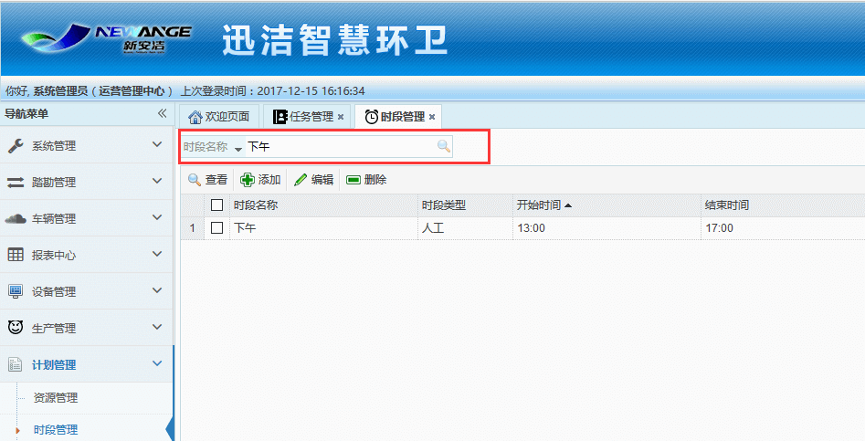

时段管理用于管理作业人员的工作时段。同时也是考勤报表的依据。时段决定着作业人员的考勤工时。
其主要功能有：查看、添加、编辑、删除和根据时段名称进行查询
注意：如果编辑或者删除了已经下发计划的时段，并不影响已经下发的计划，保持原时段。
* **添加时段**
输入时段名称、开始时间、结束时间、巡查结束时间，时段类型，点击保存即可。开始时间：表示作业人员开始工作的时间；结束时间：表示作业人员结束工作的时间；巡查结束时间：表示巡查员结束巡查的最后时间。
注意：巡查开始时间和作业人员的开始时间是保持一致的。时段类型要选择人工

* **编辑时段**
发现已经添加的时间有错误时，可对其进行编辑。
注意：在这里编辑时段，不会影响到已经下发计划的作业时段。

* **查看时段**
选中一个时段，点击查看

* **删除时段**
选中一个时段，点删除即可。

* **搜索时段**
当时段太多，无法快速找到，可在搜索栏中输入时段名称，点击搜索，快速查找到该时段
