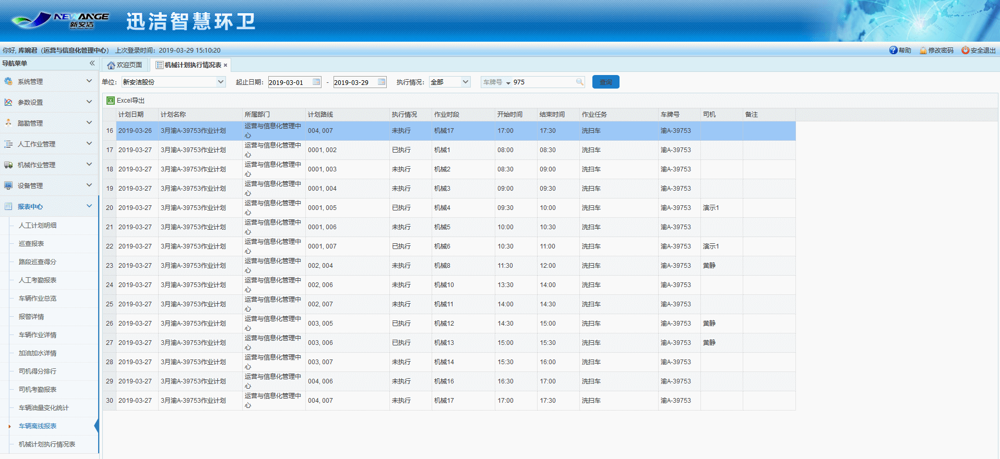

机械作业执行情况表主要是机械主管通过车载app对车辆计划的执行情况进行监控，从而生成机械作业执行记录，以图表的形式展示。
可根据车辆开始时间进行筛选，也可根据部门、车牌号和车辆类型进行搜索。
执行情况分为二种状态：未执行、已执行
 在一个计划时段内，分为多条路线，每条路线都会出现开始作业和结束作业。
在一条计划时段内，将所有路线都点击开始作业和结束作业，则产生一条已执行的车辆计划执行情况记录；
在一条计划时段内，不点击开始作业和结束作业，或者只点击多条路线中的某一条路线时，则产生一条未执行的机械作业执行情况记录。
