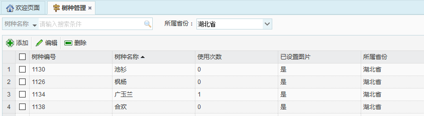
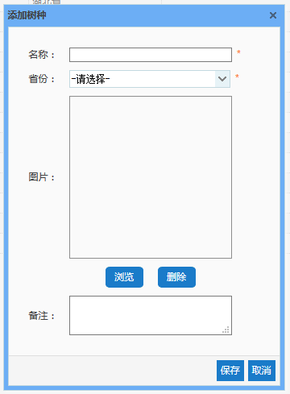

树种管理是对踏勘项行道树树种的基础数据进行管理的模块，包括树种添加，树种编辑，以及树种删除。该模块中添加的树种信息在整个系统中都将通用。
系统中已录入各省份的常见行道树基础数据，若踏勘过程中发现某一省份的某一行道树树种，可通过该模块进行该树种的添加。踏勘人在使用APP进行踏勘时，则会根据道路所在省份筛选出该省常见行道树，作为行道树树种的选择项。
 
图 3.2 10树种管理界面
* **添加树种**
点击【添加】按钮，弹出添加树种对话框，输入相应信息，点击【保存】按钮，即可实现树种的添加。
 
* **编辑树种**
选中一条需要进行修改的树种数据，点击【编辑】按钮，弹出编辑树种对话框，对相应信息做出修改后，点击【保存】按钮，即可完成对树种信息的编辑。
* **删除树种**
选中一条需要删除的树种数据，点击【删除】按钮，即可删除该树种数据。
注意：当该树种已被使用过，即使用次数不为0时，无法删除该树种。
