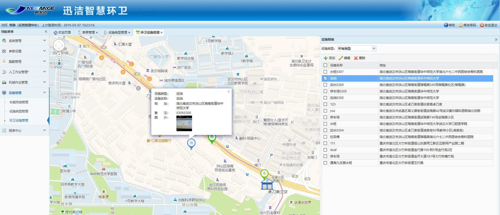
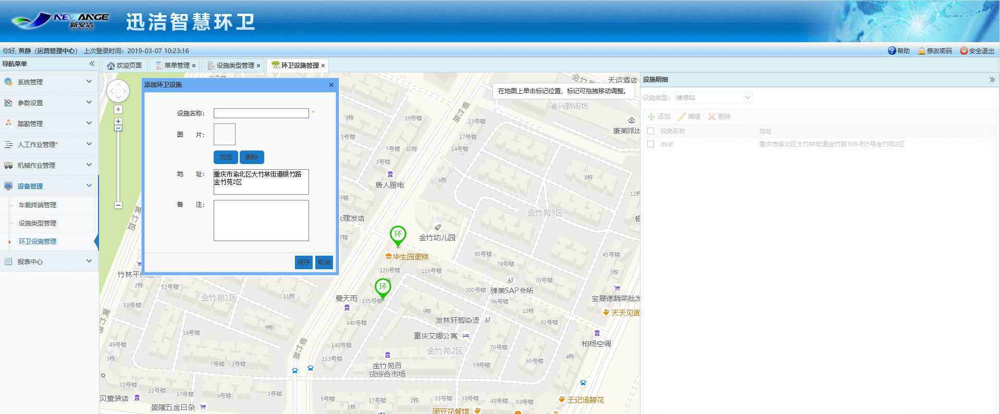

主要是在地图上标注环卫设施的位置，对环卫设施进行管理，添加、编辑、删除、查看。             
点击地图照片，可查看大图。
注意：这里添加的加油和加水点，在机械作业app上是可以进行补给点导航的。

* **添加环卫设施**
首先选择一种设施类型，点击添加按钮，地图上会提示：在地图上单击标记位置，标记时可拖拽移动位置。在地图上单击，弹出添加环卫设施的对话框
地址会根据在地图上单击的位置自动写入，输入设施名称，选择图片，点击保存按钮即可

* **编辑环卫设施**
选中一个环卫设施，点击编辑按钮，地图上会提示：弹跳点即编辑的点，可拖动地图上标记点的位置。修改相应信息，如果要修改在地图上的位置，则鼠标移至弹跳点，图片停止弹跳后，点击图片移动在地图上的位置，松开鼠标，地址会根据地图上的定位点而改变，确认无误后，点击保存即可。

* **删除环卫设施**
选中一个环卫设施，点击删除即可。
