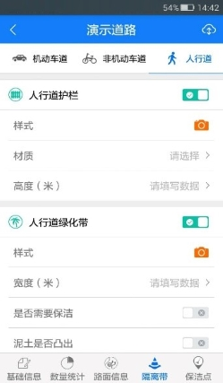

现场踏勘主要是利用迅洁APP进行城市道路状况、周边商业设施、车流量、人流量等数据的收集。流程如下：
* **开始任务**
在当前任务页面中，显示出所有指派给该踏勘人的道路踏勘任务，踏勘人选择一条待踏勘的道路，点击【开始】按钮，进入到该道路的数据采集页面。
踏勘人开始任务后，管理平台上【道路管理】中该道路的状态由“未踏勘”更新为“踏勘中”。

图 3.2 14开始任务
* **现场踏勘**
现场踏勘中需采集的数据分为5类：基础信息、数据统计、路面信息、隔离带以及重要保洁点。
基础信息主要是对城市道路的动态状况的统计。
	
图 3.2 15基础信息
数量统计主要是对道路公共设施，周边商业网点的统计。点击需要统计数量的踏勘项，在弹出的框中点击“+”或“-”修改该踏勘项的数量，也可直接输入数量数据。

图 3.2 16数量统计
路面信息中，将道路分为机动车道与非机动车道来统计路面的相关信息。
        
图 3.2 17路面信息
注意：踏勘类标题栏后面的开关表示该条道路上是否存在该类设施。若没有该类设施，可关闭该类信息，关闭后，其相应踏勘项也将被隐藏。
隔离带中，按照机动车道、非机动车道以及人行道分为3类来统计路面护栏及绿化带信息。
        
图 3.2 18隔离带
保洁点是对踏勘过程中发现的需要重点保洁的地点的信息的统计。当位置信息中输入相同信息时，保洁点列表中会将其自动显示在一起。
    
图 3.2 19重要保洁点
注意：数据采集过程中，每完成一部分数据采集，可点击踏勘页面右上角的上传按钮，及时将数据进行上传，避免一次性上传大量数据，导致上传的时间过长。
## **提交踏勘结果**
踏勘数据全部采集完成，并确认无误后，返回“我的任务”页面，点击【完成】按钮，确认后，即可将踏勘结果所有数据上传至管理平台，踏勘人在“历史任务”列表中可以看到完成的任务。若踏勘数据未采集完全，点击【完成】按钮时，将提示出具体未完成的踏勘项。
踏勘人完成任务后，管理平台上【道路管理】中该道路的状态由“踏勘中”更新为“踏勘完成”。
         
