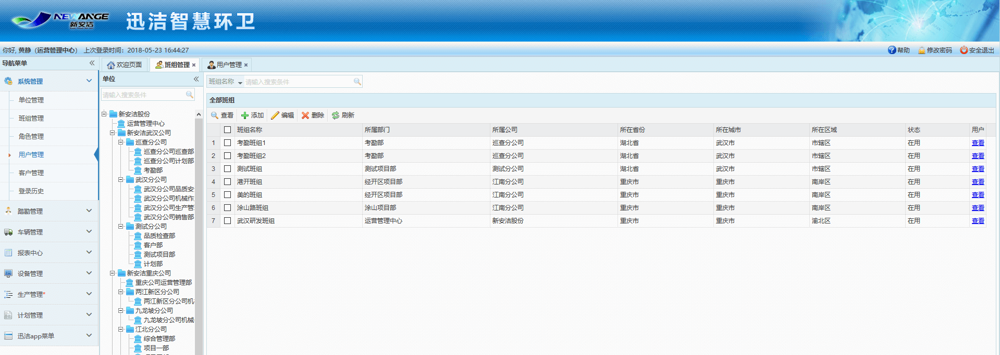
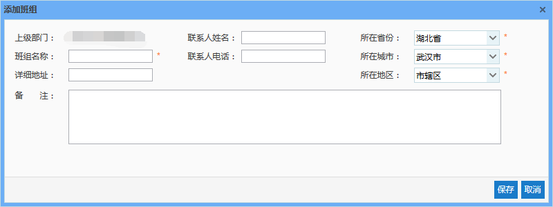
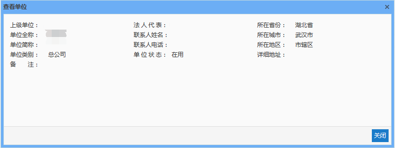
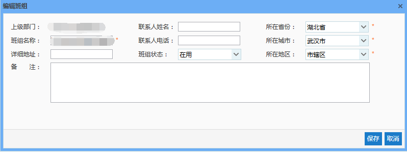
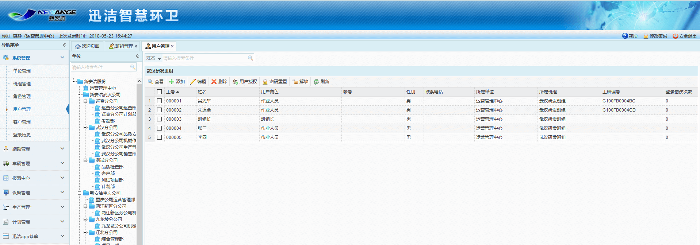

一个部门下，通常还会有很多个班组，班组管理就是对班组的查看、添加、编辑以及删除。系统中已添加示例数据，可根据实际情况对该数据进行处理。

* **添加班组**
由于班组是属于部门的，因而必须在部门下添加。在左侧单位树中选择一条部门数据，点击【添加】按钮，弹出添加班组对话框，此时上级部门项显示为选择的部门的名称。输入相关信息，点击【保存】按钮，即可成功添加班组信息。其中，所在省市区信息会自动填充上级部门所在省市区信息，可根据实际情况进行修改。
当单位树中未选择或选择非部门数据时，会提示只能在部门下进行添加。
   
* **查看班组**
选中一条班组数据，点击【查看】按钮，弹出查看班组对话框，即可查看该班组的全部信息。
 
* **编辑班组**
当班组信息需要进行修改时，选中该数据，点击【编辑】按钮，弹出编辑班组对话框，即可对该班组信息进行编辑。
 
* **删除班组**
选中一条数据后，点击【删除】按钮，即可删除该班组数据。需要注意的是，当删除的班组下存在用户等数据时，将无法删除。
注意，删除后数据将无法恢复，因此建议只在添加班组出错时使用。若该班组不再使用，建议通过编辑功能将其停用。
* **查看组员**
点击班组右侧的查看链接，页面跳转至用户管理，可以查看该班组下的所有组员

* **刷新**
点击【刷新】按钮，可对班组列表信息及单位树进行刷新。
