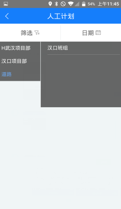
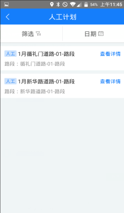
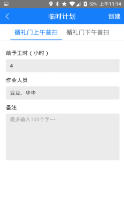
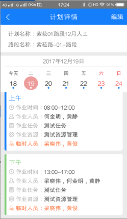

班组长的主要权限：查看组员的作业计划和新建临时计划。
班组长登录迅洁app，进入作业计划，可以根据组员进行筛选。点击筛选，先筛选如图1，选择组员，点击查询，如图2，显示当前道路的所有路段的作业计划，点击日期，再点击查询，查看计划详情可以查看当前日期的计划详情。点击不同的日期，则显示不同日期的计划详情。
班组长和作业人员区别就是进入计划详情后，可以新建临时计划，比如：有组员请假了，需要临时调整路段的作业人员；另外一个区别就是：作业人员看到的是和自己有关的作业计划，而班组长 看到的是自己所有组员的作业计划。
注意：计划详情里，日历上，蓝色的点：表示当天有作业计划；红色的点：表示计划变动过，班组长或其他管理人员曾经添加过临时计划。

* **新建临时计划**
             只能对还未开始的作业计划新建临时计划。
点击编辑，选择要建临时计划的计划明细，点击新建，如图2，输入计划名称，选择员工，点击创建，如图3，计划明细里多出一行临时人员。

