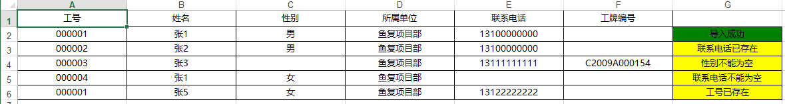
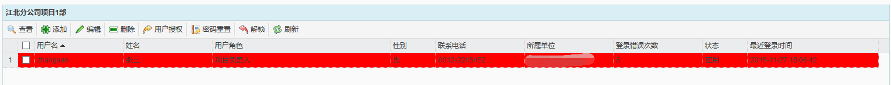

用户管理主要是对使用该系统的用户进行查看、添加、编辑、删除、授权、密码重置以及解锁及批量导入用户。

图 3.1 18用户管理界面
* **添加用户**
在左侧单位树中选择一条部门数据，点击【添加】按钮，弹出添加用户对话框，此时所属单位项显示为当前选择的部门的名称。输入相关信息，点击【保存】按钮，即可成功添加用户信息。其中，所属单位框中默认显示选中的部门，更改时，只能选择在其他部门或班组下进行保存。并且，用户名保存成功后，将无法进行修改。
添加用户时，类型选择用户，添加客户时，类型选择客户。添加用户时，工号和姓名是必填项，添加客户时，姓名和联系电话是必填项。
注意：单位树中未选择或选择非部门数据时，会提示只能在部门下进行添加。
只能对班组下的员工绑定工牌。
  
  
* **用户授权** （可单独授权也可批量授权）
选中一条用户数据，点击【用户授权】按钮，弹出用户角色授权对话框，勾选需要授权的用户角色，点击【保存】按钮，即可对该用户进行授权。
注意：1. 用户角色授权对话框中只会显示当前用户所在部门的角色。
2. 由于一线员工数量多，角色权限基本一致，可以选择所有的一线员工进行批量授权。
  
* **批量导入会员**
  首先需要下载模板，模板是一个Excel表格，将用户的信息填入表格后保存好，再点击浏览，选择保存好的用户信息表格，点击上传即可。上传完成后会返回一张Excel表格，提示哪些导入成功，哪些导入失败

* **编辑用户**
选中一条数据，点击【编辑】按钮，弹出编辑用户对话框，即可对该用户信息进行修改。
当用户编辑所属单位时，只能选择部门或班组进行保存，若用户所属单位发生变化，原授权角色将会被取消，即用户处于未授权状态。
当用户离职后，只需将用户状态修改为停用，该用户便无法登录系统。
 编辑用户时，不可以编辑类型。

* **删除用户**
选中一条数据后，点击【删除】按钮，即可删除该用户数据。
* **密码重置**
当用户忘记密码时，选中该用户，点击【密码重置】，即可将该用户密码重置为默认密码。
* **解锁**
当用户登录错误次数达到15次后，该用户将会被锁定，当天内无法登陆系统，且在用户列表中，该用户信息背景显示为红色高亮。此时，选中该用户，点击【解锁】按钮，即可解锁该用户，该用户可再次登录系统，解锁后密码仍为用户设定的密码。
 
图 3.1 22用户锁定
* **刷新**
点击【刷新】按钮，可对用户列表及单位树中的信息进行刷新。
