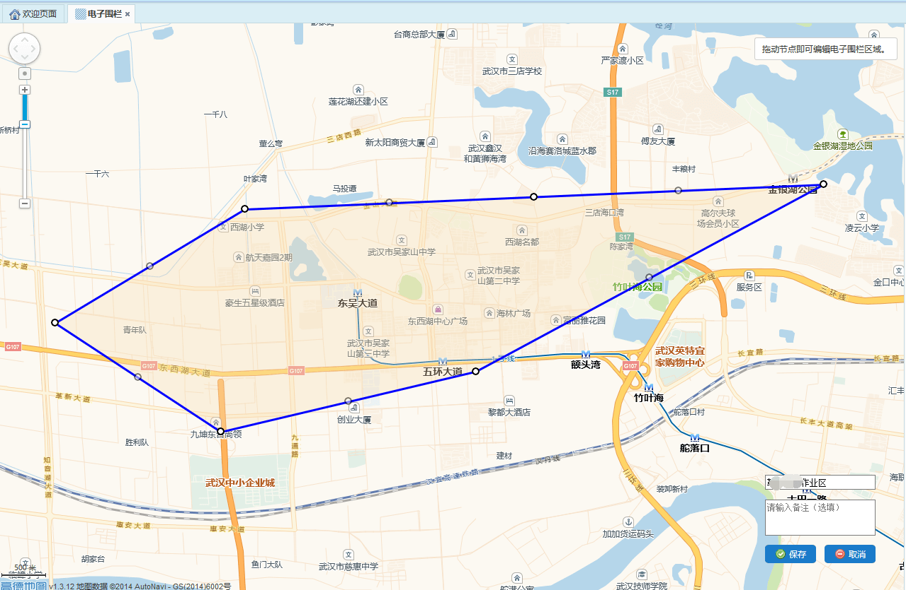

电子围栏是一个对车辆运行区域进行划分的模块，包括电子围栏的查看、添加、编辑、删除，以及车辆的绑定。

* **添加电子围栏**

	点击【添加】按钮，在地图上单击开始绘制多边形区域，绘制过程中滚动鼠标滚轮可调整地图大小，长按鼠标左键可拖动地图，鼠标左键双击或右键单击可结束当前多边形的绘制。电子围栏区域绘制完成后，在地图右下角的输入框中输入相应的电子围栏名称和备注，点击【保存】按钮，即可完成电子围栏的添加。
 

	图 3.4 13添加电子围栏

* **查看电子围栏**

	选中一条需要查看的电子围栏数据，点击【查看】按钮，地图区域中显示出该电子围栏的区域，查看电子围栏对话框中显示该电子围栏相关信息。
点击电子围栏对话框中的【取消】按钮，即可退出查看。只有退出查看状态后，才可进行其他操作。
 

	图 3.4 14查看电子围栏

* **编辑电子围栏**

	选择一条需要进行修改的电子围栏数据，点击【编辑】按钮，地图区域中显示出该电子围栏区域，拖动节点即可编辑电子围栏区域，双击实心节点可取消该节点，电子区域修改完成后，可在地图右下角的输入框中修改电子围栏名称和备注，点击【保存】按钮，即可完成电子围栏的修改。
 

	图 3.4 15编辑电子围栏

* **删除电子围栏**

	选择一条需要被删除的电子围栏数据，点击【删除】按钮，即可删除该电子围栏数据。
             注意：当电子围栏已经有绑定车辆时，需先取消车辆的绑定后，才能删除该电子围栏。
* **选择车辆**

	电子围栏只有选择车辆之后，才能起到围栏的作用，因而电子围栏添加完成之后，需要给该电子围栏选择车辆。选择需要绑定车辆的电子围栏数据，点击【选择车辆】按钮，弹出选择车辆对话框，在弹出的对话框中选中在该电子围栏范围内的车辆（可多选），点击【保存】按钮，即可为该电子围栏选择车辆。
 

	图 3.4 16选择车辆
