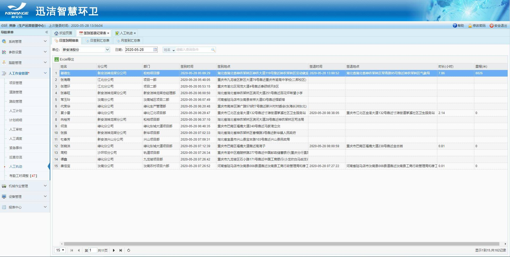

## 签到签退记录表
1. 展示所有用户在迅洁app端的签到签退记录；
2. 分3张表：日签到明细表、日签到汇总表、月签到汇总表；
3. 每张表都可以根据单位进行筛选、并且可以Excel导出；
4. 日签到明细表展示用户每日的签到签退明细、时间、地点、里程、时长；
5. 日签到汇总表将用户的日签到签退时长累加起来，计算当日的总时长和总里程，可以查看个人明细；
6. 月签到汇总表统计用户当月的迅洁app签到签退的总时长和总里程，也可以查看明细；
