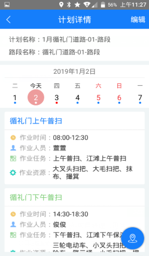

生产主管登录迅洁app，进入作业计划，可以根据部门进行筛选项目、道路，查询相应的作业计划。点击筛选，先筛选部门、部门下的项目、道路，点击查询，如图2，显示当前道路的所有路段的作业计划，点击日期，再点击查询，查看计划详情可以查看当前日期的计划详情。点击不同的日期，则显示不同日期的计划详情。

* **新建临时计划**
只能对还未开始的作业计划新建临时计划。
点击编辑，选择要建临时计划的计划明细，点击新建，如图2，输入计划名称，选择员工，点击创建，如图3，计划明细里多出一行临时人员。
注意：日历下面有蓝色的点点，表示当天有作业计划，新建临时计划后，日历上的蓝色点点变成红色点点，故只要看到红色点点，就表示当天的计划被改动过，有人员请假或者调班。

