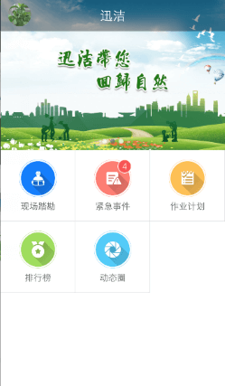
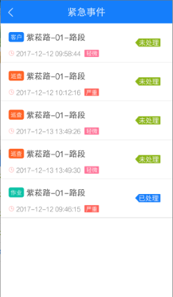
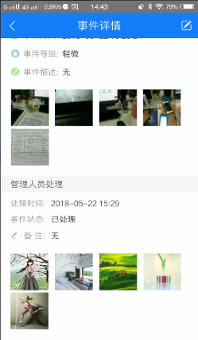

# 紧急事件-管理员
紧急事件管理员也可通过登录迅洁APP来随时接收和处理紧急事件。只有用户所属角色的菜单权限中包括紧急事件管理员菜单，在登录迅洁APP后才能接收和处理紧急事件。

* **处理紧急事件**
紧急事件管理员登录迅洁APP后，首页中会出现一个紧急事件功能按钮，且该按钮上会显示当前未处理的紧急事件的条数。
点击紧急事件，直接进入紧急事件列表，即可查看全部紧急事件，点击某一条紧急事件，可查看该紧急事件详情，且可点击详情页右上角的处理按钮，对该紧急事件进行处理，处理时可拍照上传处理结果。**对于客户上报的紧急事件，必须拍照处理。**

* **接收紧急事件消息提醒**
作业人员、巡查员和客户 上报紧急时间事件后，紧急事件的管理员登录迅洁app，会收到一条消息：某某路段发生了紧急事件
注意：只有紧急事件管理员登录了迅洁app时，才能收到消息，如果作业人员和巡查员上报紧急事件时，未登录app则收不到消息，后续再登录app也不会收到消息