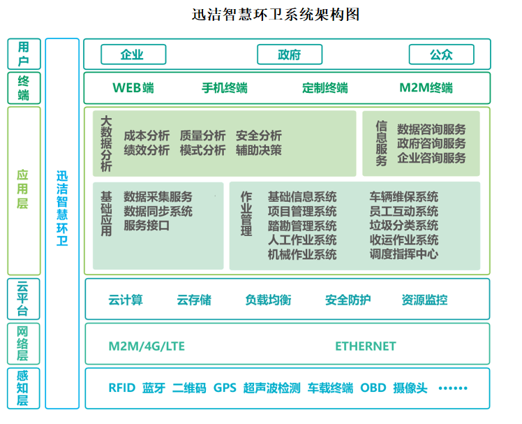
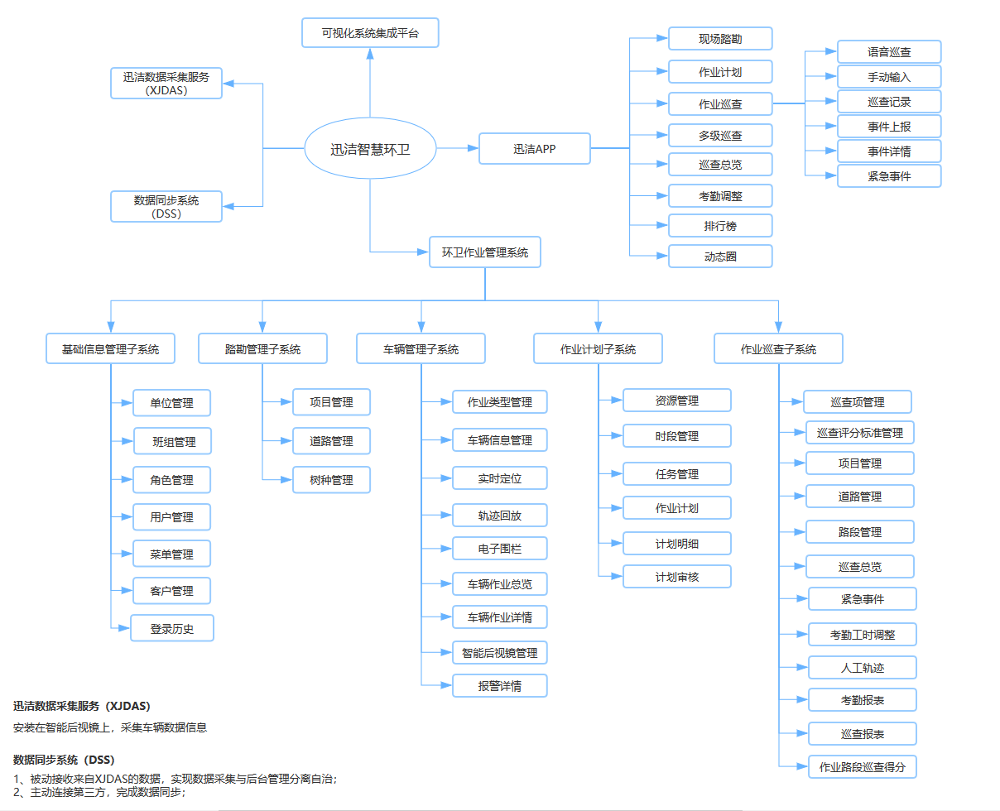

## 迅洁智慧环卫架构图

新安洁智能环卫云平台由多个子系统构成，每个子系统协同工作。
## 系统组成

**环卫作业管理系统**

用于管理人员在PC端进行基础信息、踏勘及车辆等的管理。具备集中管理，查看报表，进行各类数据汇总，分析的优势。
**迅洁APP**

安装在安卓移动终端，供管理人员或员工使用，实现接收任务，数据上传等功能。具备便携性，时效性等优势。
**迅洁数据采集服务（XJDAS）**

安装在智能后视镜上，采集车辆数据信息并实时上传。
**数据同步系统（DSS）**

1、被动接收来自XJDAS的数据，实现数据采集与后台管理分离自治；
2、主动连接第三方，完成数据同步。
