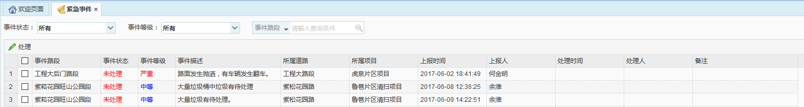
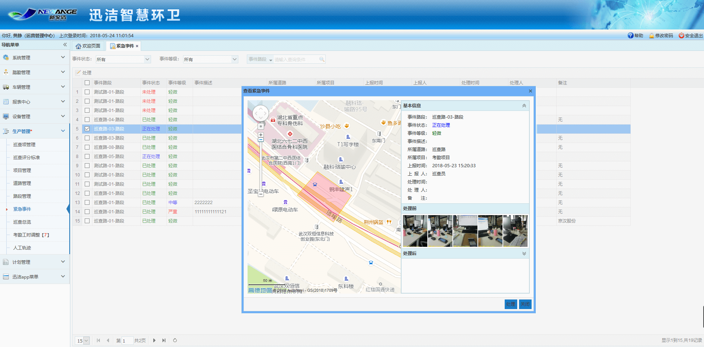
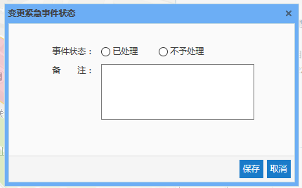
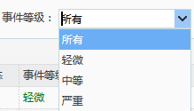
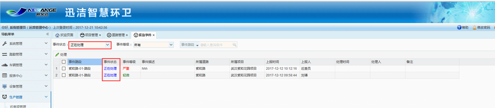

当作业巡查过程中上报过紧急事件，可在紧急事件模块中查看紧急事件信息并进行处理。
生产主管登录系统后，若存在未处理的紧急事件时，浏览器页面标题会一直闪烁，提示有新的紧急事件；
页面右下角弹出提示显示未处理的紧急事件数量，点击该提示信息，会直接跳转到紧急事件列表；
当有新的紧急事件上报时，会直接提示XX路段发生了紧急事件，点击该信息，直接进入该紧急事件详情。

             
图 3.5‑31紧急事件列表
* **紧急事件处理**
选择一条需要填写处理状态的紧急事件，点击【处理】按钮，弹出查看紧急事件对话框，该对话框中右侧地图中显示出紧急事件路段的地理位置信息，左侧显示事件路段名称、事件状态、事件等级、事件描述、所属道路、所属项目、上报事件、上报人、处理信息以及事件照片，未处理时处理信息显示为空。
点击处理按钮，弹出变更紧急事件状态对话框，可输入事件状态及备注信息，事件状态分为已处理和不予处理，根据事件处理的实际情况选择，点击【保存】按钮后，即可完成紧急事件的处理。
紧急事件状态分为未处理、正在处理、已处理和不予处理4个状态，紧急事件上报后状态为未处理状态，管理员查看紧急事件后，状态变更为正在处理，若对紧急事件进行处理后，根据处理状态，分为已处理和不予处理。其中，当状态为未处理时，巡查员可对该紧急事件进行再次上报或删除该紧急事件。

             
图 3.5‑32查看紧急事件

             
图 3.5‑33变更紧急事件状态
* **根据事件状态、事件等级或事件路段进行查询**
事件状态有：
事件等级有：

根据任意一个条件查询均可。
