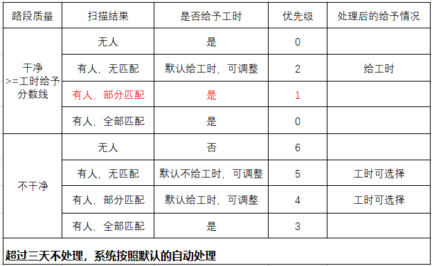
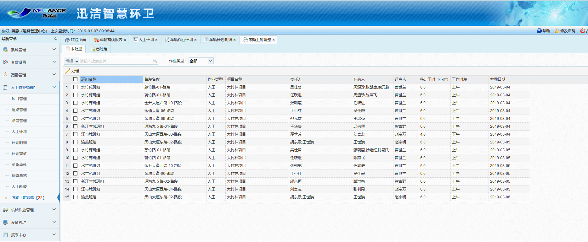
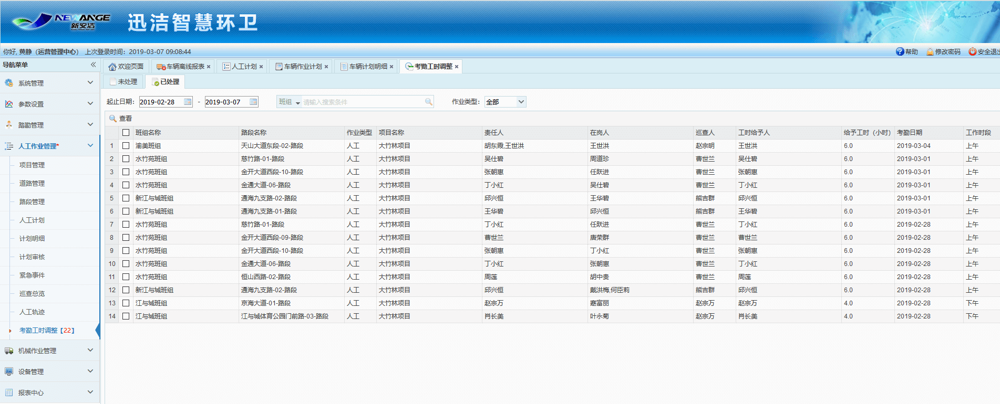
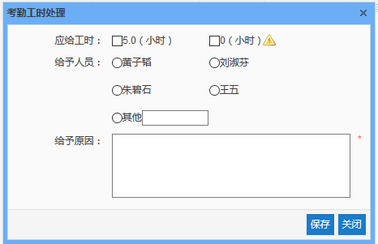
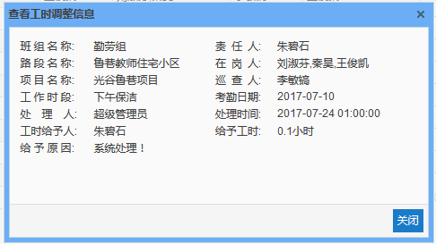

 当对某一路段进行巡查的过程中，若出现责任人调班或换班的情况时，无法准确扫描到责任人，但扫描到其他环卫工人时，可在考勤工时调整中，根据实际情况将该路段的工时给予人调整为当时该路段的责任人，即调班或换班后的环卫工人。

图 3.5‑36未处理考勤工时记录

图 3.5‑37已处理考勤工时记录
* **考勤工时处理**
在未处理标签页下可查看待处理的考勤记录，选择一条需要进行处理的考勤记录，点击处理按钮，弹出考勤工时处理对话框，即可进行考勤工时的处理，考勤工时处理主要有2种情况：
1.默认给工时的情况，即作业路段得分超过工时给予线，这种情况下，无论工时给予人选择谁，均会给予相应的工时；
2.默认不给工时的情况，即作业路段得分低于工时给予线，这种情况下，当选择的工时给予人是在岗人时，会给予相应的工时，当选择的工时给予人非在岗人时，用户可选择是否给予该工时给予人相应的工时。

图 3.5‑38考勤工时处理
当工时调整记录超过3天未调整，系统会自动进行调整，工时给予人仍为该路段原责任人，考勤工时也仍按照默认情况给予。

* **考勤工时调整记录查看**
 可根据考勤日期进行搜索，也可根据班组、路段、巡查人、处理人进行查询已处理的考勤记录。
在已处理标签页下，可查看已经处理了的考勤工时记录，选择一条需要查看详细信息的考勤记录，点击查看按钮，即可查看该条考勤工时调整记录的详细信息。

图 3.5‑39查看工时调整信息