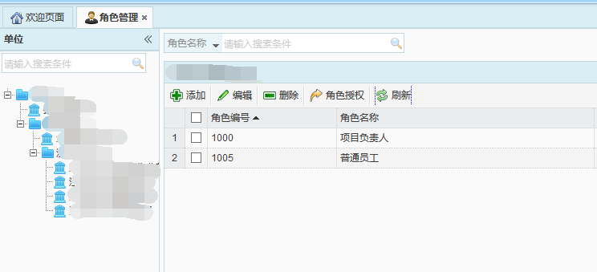

角色相当于岗位，对用户授予角色权限，可实现对用户的系统权限的管理。角色管理主要是对角色的添加、编辑、删除以及授权。
 
* **添加角色**
在左侧单位树中选择一条部门数据，点击【添加】按钮，弹出添加角色对话框，此时所属单位项显示为当前选择的部门的名称。输入相关信息，点击【保存】按钮，即可成功添加角色信息。
单位树中未选择或选择非部门数据时，会提示只能在部门下进行添加。
注意：每个部门都需要创建自己部门的角色，角色不可跨部门使用。
 
* **角色授权**
选择一条角色数据，点击【角色授权】按钮，弹出角色的菜单权限对话框，勾选需要授权的菜单，点击【保存】按钮，即可实现对该角色进行授权。授权该角色的用户在登录系统后，页面中只展示该角色已经授权的菜单，且可使用。

* **编辑角色**
选择一条数据，点击【编辑】按钮，弹出编辑角色对话框，即可对该角色信息进行编辑。其中，角色编号及所属单位不可进行修改。
 
* **删除角色**
选中一条数据后，点击【删除】按钮，即可删除该角色数据。
注意：当删除的角色下存在用户等数据，即存在用户授权为该角色时，将无法删除该角色。
* **刷新**
点击【刷新】按钮，可对角色列表及单位树中信息进行刷新。
