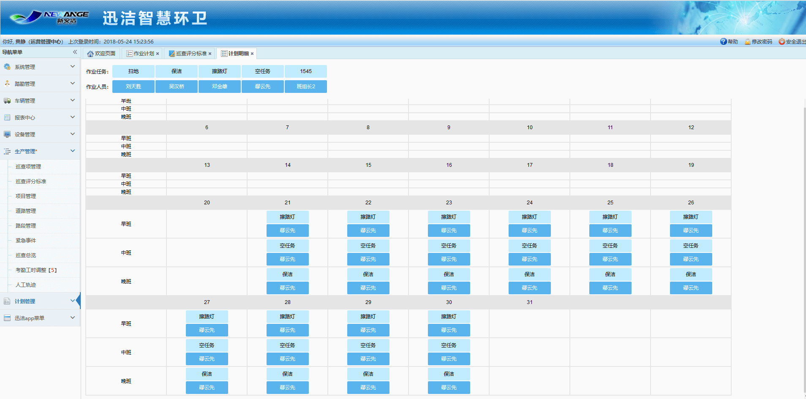
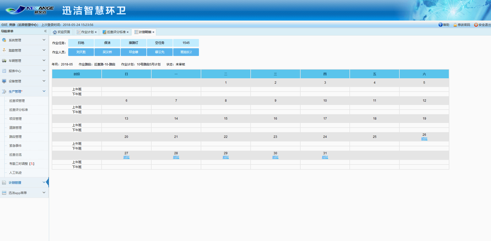
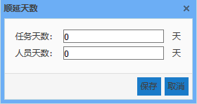

计划明细里，制作当月的计划如下图：
可以先安排当月的哪些任务，将任务拖动到相应的日期的时段里，当天只能做第二天到月底的计划，拖动完第一天的任务，如果后面的任务和第一天相同，可点击顺延，弹出顺延天数的提示框，比如：任务要顺延5天，任务天数填5，点击保存即可。日历里会自动填充后面5天的任务。
再来安排这条路段每天的不同时段都有谁来负责。拖动人员到相应的日期的时段里，操作方法与任务相同。当月计划必须做完才能去提交审核。

