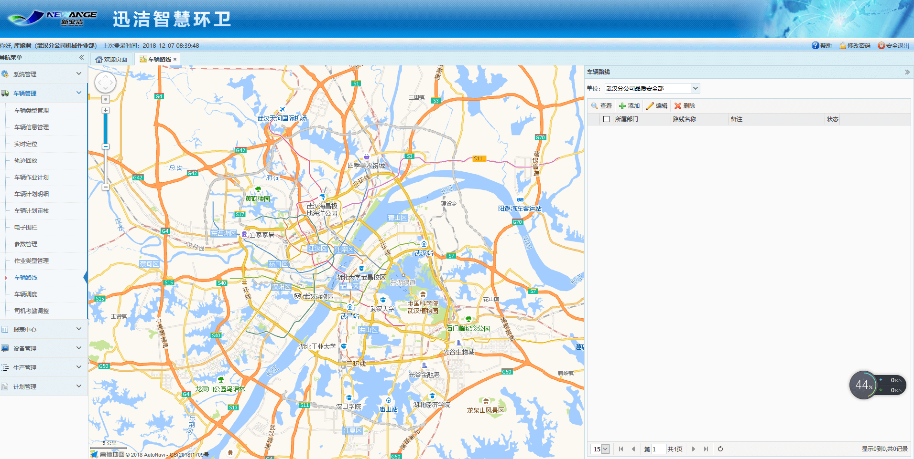
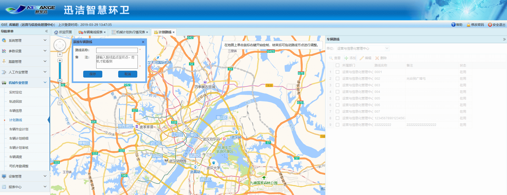
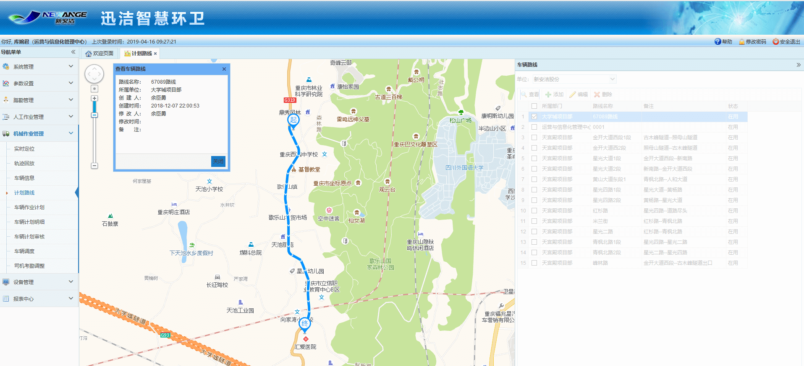
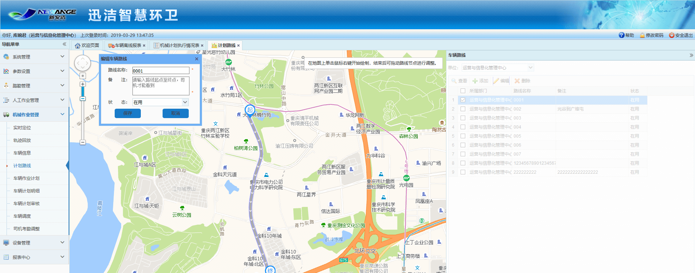

车辆路线需结合地图对公司或部门底下的车辆行驶路线进行绘制，包括车辆行驶路线的查看、添加、编辑、删除。

* **添加车辆路线**
点击【添加】按钮，地图区域中弹出添加作业路段对话框。
在地图上右键单击开始绘制车辆路线，绘制过程中滚动鼠标滚轮可调整地图大小，长按鼠标左键可拖动地图。右键设为起点，再设为终点，根据路线多次设置终点，之前的终点就会变成途径点，可以通过拖拽终点的方式继续往前画路线。地图上会显示绘制的车辆路线。车辆路线绘制完成后，在地图左上角，输入框中输入：路线名称和备注，点击【保存】按钮，即可完成车辆路线的添加。
注意：绘制计划路线的途径点不得超过16个。（高德地图官方限制）

* **查看车辆路线**
右侧列表中选中一条需要查看的车辆路线数据，点击【查看】按钮，该车辆路线以绿色的形式展现在地图中心区域，查看车辆路线对话框中显示该车辆路线相关信息。
点击查看车辆路线对话框右上角的关闭按钮，即可退出查看。只有退出查看状态后，才可进行其他操作。

* **编辑车辆路线**
             右侧列表中选择一条需要进行修改的车辆路线数据，点击【编辑】按钮，地图区域中以绿色的形式显示出该车辆路线，拖动节点即可编辑车辆路线，车辆路线修改完成后，可在地图左上角的输入框中修改车辆路线名称、状态和备注，点击【保存】按钮，即可完成车辆路线的修改。

* **删除车辆路线**
             右侧列表中选中一条需要删除的车辆路线数据，点击【删除】按钮，即可删除该车辆路线数据。

