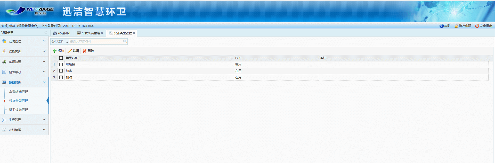
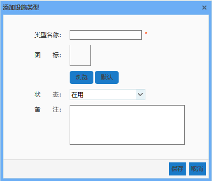
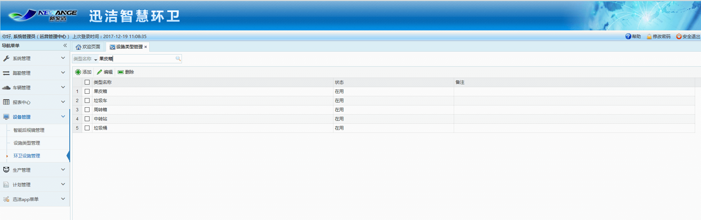

主要用于管理设施类型，主要功能对设施类型进行添加、编辑、删除以及根据设施类型名称进行查询
注意：加油和加水这两种设施类型是系统默认就有的，并且不可以编辑和删除

* **添加设施类型**
输入类型名称，选择图片，选择状态，输入备注，点击保存即可。

* **编辑设施类型**
选择一条数据，点击编辑按钮，修改相关信息，点击保存即可。

* **删除设施类型**
选择要删除的设施类型，点击删除即可。

* **根据类型名称进行搜索**
输入类型名称，点击搜索按钮
