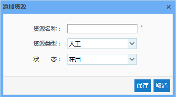
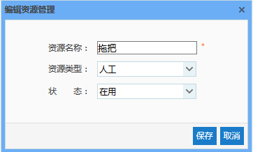
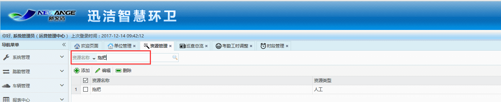

资源管理主要用于管理作业人员作业时使用的清扫清洁用品。
其主要功能有添加资源、编辑资源、删除资源以及根据资源名称进行搜索
* **添加资源**
输入资源名称、选择资源类型、状态点击保存。
注意：资源类型分两种：人工和机械。人工的作业计划只能选择人工资源，机械的作业计划只能选择机械资源。
注意：状态分两种：在用和停用。在做作业计划时，只能选择在用的资源，看不到停用的资源。

* **编辑资源**
用于资源添加时添加错误，对其进行修改，操作是选中这条资源，点击编辑，修改好后，点击保存即可。

* **删除资源**
该资源已经不再使用了，可以将其删除。操作是选中这条资源，点击删除。

* **搜索资源**
当资源太多，无法快速找到，可在搜索栏中输入资源名称，点击搜索，快速查找到该资源

