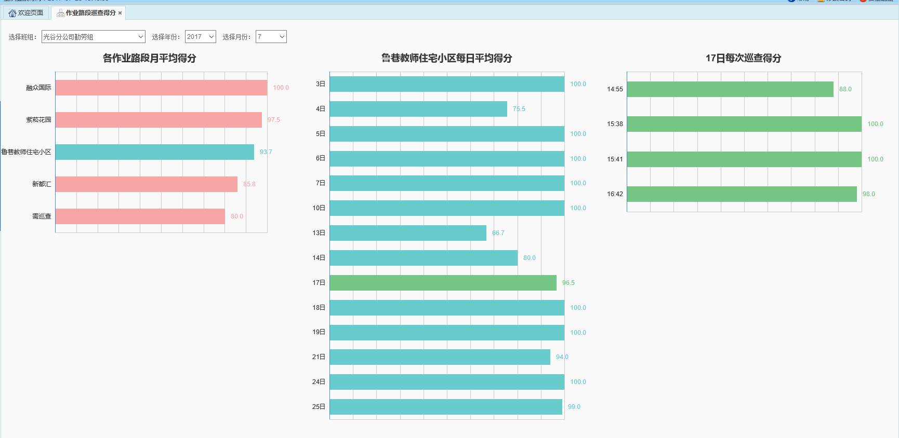

路段巡查得分模块中包含3个柱状图信息，包括作业路段月平均得分比较图、作业路段日平均得分比较图、作业路段巡查得分比较图。
下拉框中选择一个班组及查询日期，作业路段月平均得分比较图中会显示该班组下全部作业路段的月平均得分比较图。
点击作业路段月平均得分比较图中某一作业路段，作业路段日平均得分比较图中会显示该作业路段在该月的每日平均得分比较图。
点击作业路段日平均得分比较图中某一天，作业路段巡查得分比较图中会显示该天该路段每一次巡查得分情况。

图 3.5‑40作业路段巡查得分比较图