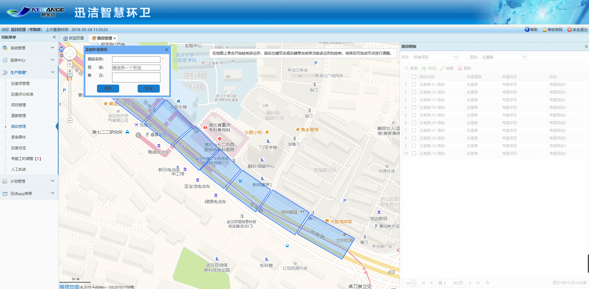
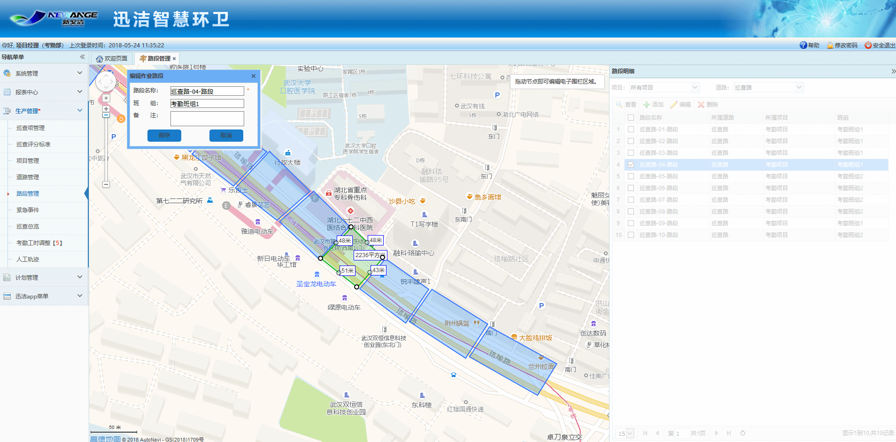

因为环卫作业过程中，一个责任人不可能负责一整条道路，因此需要将一条道路划分为多个作业路段，每个作业路段绑定一个责任人。作业路段管理中需结合地图对作业路段进行划分，包括作业路段的添加、编辑、删除。

* **添加作业路段**
需先在道路下拉框中选中一条道路后，再点击【添加】按钮，地图区域中弹出添加作业路段对话框。
在地图上单击开始绘制作业路段区域，绘制过程中滚动鼠标滚轮可调整地图大小，长按鼠标左键可拖动地图，鼠标左键双击或右键单击可结束当前多边形的绘制。地图上会显示绘制图形的长度、宽度和总面积。作业路段区域绘制完成后，在地图左上角的输入框中会自动生成作业路段的名称，点击班组输入框，可以选择现有的班组，点击【保存】按钮，即可完成作业路段的添加。

**注意：1.作业路段添加好后，会自动生成一个与该路段对应的班组，该路段在做作业计划时，只能选择该班组下的员工。
		  2.作业路段名称规则：道路名称-编号-路段，当前道路的第一条路段，编号是01，第二条路段，编号是02，以此类推。**

* **查看作业路段**
右侧列表中选中一条需要查看的作业路段数据，点击【查看】按钮，该作业路段区域以绿色的形式展现在地图中心区域，查看作业路段对话框中显示该作业路段相关信息。
点击查看作业路段对话框右上角的关闭按钮，即可退出查看。只有退出查看状态后，才可进行其他操作。

* **编辑作业路段**
右侧列表中选择一条需要进行修改的作业路段数据，点击【编辑】按钮，地图区域中以绿色的形式显示出该作业路段区域，拖动节点即可编辑作业路段区域，双击实心节点可取消该节点，作业路段区域修改完成后，可在地图左上角的输入框中修改作业路段名称和备注，点击【保存】按钮，即可完成作业路段的修改。

* **删除作业路段**
右侧列表中选中一条数据后，点击【删除】按钮，即可删除该作业路段数据。

