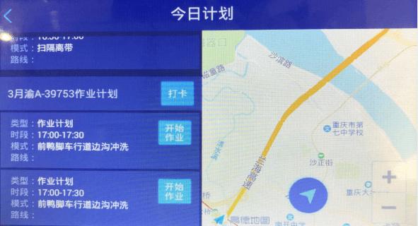

机械作业app主要是用于司机在工作前，录入指纹，工作时，打卡后开始作业，查看作业计划和作业路线，根据计划路线的导航来进行工作。

* **录入指纹**
司机需先在“录入指纹”模块中录入指纹，才能根据车辆计划或者车辆调度的作业时段结束前，在“今日计划”模块中打卡进行作业。一个司机最多可录入5个指纹，可重复的录入相同的手指，录入成功后，才可进行打卡，录入失败，则无法进行打卡。
操作步骤：点击进入机械作业\-点击录入指纹\-输入司机的工号\-点击确定\-按下指纹。

* **今日计划**
司机打开今日计划，可以查看该车辆今天的作业计划和调度计划，点击打卡后，可点击开始作业和结束作业，完成今日的车辆计划和调度计划，点击导航可以按照计划规定的车辆路线进行导航。
点击“开始计划”，地图上自动定位当前车辆所在位置，并显示该车辆的计划行驶路线，如果车辆行驶路线与计划路线不同，则语音报警：您已偏离路线！
web端报警详情里会显示该报警信息
司机必须在作业时段结束前打卡，车辆规定的作业时间段结束前点击开始作业和结束作业，才会统计考勤。
备注：Web端与app端有任何改动，车载app都会实时更新；当天的车辆计划和车辆调度只能在计划时间段开始前一小时，进行打卡和开始作业\-结束作业。
操作步骤：点击进入机械作业\-点击今日计划\-选中车辆计划（调度计划）\-点击打卡\-输入工号\-按下指纹\-提示打卡成功\-点击该计划的开始作业\-结束作业。
备注：只能在作业时段结束前进行打卡，作业时段结束后，该车辆计划和车辆调度将没有打卡（开始作业\-结束作业）按钮，只有打卡成功，才能点击开始作业（结束作业），否则无法开始作业。打卡和开始作业都最多只能提前一小时。

* **补给点**
地图上显示当前位置周围5公里附近的加油加水点（环卫设施管理里添加的加油加水电），在地图上点击加油加水点，自动导航至该点。
* **消息推送**
当pc端或者app端出现以下5种情况时，车载终端将实时语音提醒并刷新今日计划：
 1. 创建车辆当天计划的调度任务；
 2. 创建车辆当天的临时计划；
 3. 取消原计划；
 4. 取消临时计划；
 5. 取消车辆调度。          