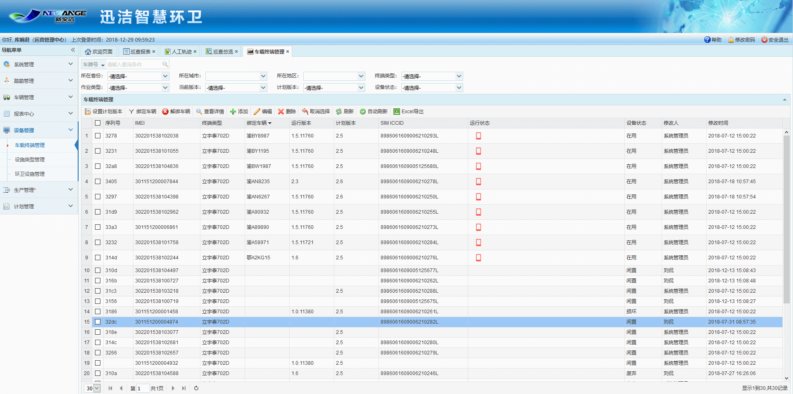

车载终端管理模块包括车载终端的查看、添加、编辑、删除，数据采集应用版本的选择以及该设备与所安装车辆的绑定。目前的车载终端有两种类型：立宇泰702D 和 合宙GPS。两种区别在于：立宇泰702D可以采集车辆的油水耗，查看车辆视频监控，而合宙GPS则是纯gps定位功能，只能看车辆的实时定位和轨迹回放。
**注意：根据当前用户所属部门来展示车载终端。**

             
图 3.4‑25车载终端管理界面
* **添加车载终端**
             点击【添加】按钮，弹出添加车载终端对话框，输入各项的信息后点击【保存】按钮。
▲项目说明：
**IMEI**：车载终端设备的唯一标识。
**设备序列号：查看方式与IMEI相同。
**SIM ICCID****：插在车载终端设备中的SIM卡的唯一标识，可在SIM卡上查看。
**SIM PUK****：SIM卡的密码，可在SIM卡的母卡上查看。
计划版本：如果设备上运行的数据采集应用的版本低于设置的计划版本，会进行更新。一般选择最新的版本。
* **查看车载终端**
             选择一条数据，点击【查看】按钮即可查看该车载终端的详细信息。
* **编辑车载终端**
             选择一条数据，点击【编辑】按钮，弹出编辑车载终端对话框，修改各项的信息后点击【保存】按钮。IMEI不可修改。
* **删除车载终端**
             选择一条数据，点击【删除】按钮即可。
* **设置计划版本**
             选择至少一条数据，点击【设置计划版本】按钮，可同时为多台车载终端设置数据采集应用的版本。
* **绑定车辆**
             选择一条数据，点击【绑定车辆】按钮，弹出绑定车辆对话框，选择该设备所安装的车辆后，点击【确定】完成绑定。
如果设备没有与车辆绑定，那么设备将无法上传采集到的数据。
* **解绑车辆**
             选择至少一条数据，点击【解绑车辆】按钮，可同时解除多对车载终端与车辆的绑定关系，解绑后删除XJDAS运行版本信息（即运行版本和计划版本的信息均为空），同时该车载终端的状态变为闲置。
* **Excel导出**
             选中查询出的数据，点击【Excel导出】按钮，可对查询出的车载终端的数据以Excel的形式导出。
